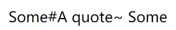
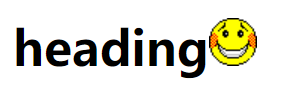

伪类
==================================

伪类可以看作以选中元素为基准点，此元素的一些状态或属性。

所有CSS伪类/元素详见https://www.runoob.com/css/css-pseudo-classes.html

超链接伪类
~~~~~~~~~~~

链接的样式可以用任何的CSS属性。

不同的链接状态可以设置不同的CSS样式

a:link-- 正常，未访问过的链接

a:visited-- 用户已访问过的链接

a:hover-- 当用户鼠标放在链接上

a:active -- 链接被点击的那一刻

举个例子：

.. code-block:: css
    :linenos:

    /* 未访问的链接 */
    a:link {
        color: #FF0000;
    }

    /* 已访问的链接 */
    a:visited {
        color: #00FF00;
    }

    /* 鼠标悬停链接 */
    a:hover {
        color: #FF00FF;
    }

    /* 已选择的链接 */
    a:active {
        color: #0000FF;
    }

注意： 

1、在CSS定义中，a:hover 必须被置于 a:link 和 a:visited 之后，才是有效的。

2、 在 CSS 定义中，a:active 必须被置于 a:hover 之后，才是有效的。
    
3、伪类的名称不区分大小写。

：lang伪类
~~~~~~~~~~~~~

:lang 伪类使你有能力为不同的语言定义特殊的规则。

举个例子： 

.. code-block:: html
    :linenos:

    <!DOCTYPE html>
    <html>
    <head>
        <meta charset="utf-8"> 
    
    </head>

    <body>
    
Some<q lang="n">A quote</q> Some

    </body>
    </html>

运行结果如图一所示：

        
    运行结果

伪元素
~~~~~~~~~~~~~

伪元素指原本不存在的元素。

:first-letter 表示元素中内容的第一个字母,只能用于块级元素

:first-line 表示元素中第一行的内容

:selection 表示元素中选中的文本

:before 表示元素中内容开始位置之前，可以结合content属性添加内容

:after 表示元素中内容结束位置之后，可以结合content属性添加内容

举个例子

.. code-block:: html
    :linenos:

    <!DOCTYPE html >
    <html>
    <head>
    
    </head>
    <body>
    
QQ

    </body>
    </html>

运行结果如图二所示：

    
    运行结果

几组常用的伪元素介绍
++++++++++++++++++++++++

**:first-line伪元素**

用于向文本的首行设置特殊样式。

可应用于 "first-line" 伪元素的属性有：

- font properties
- color properties
- background properties
- word-spacing
- letter-spacing
- text-decoration
- vertical-align
- text-transform
- line-height
- clear
  
举个例子： 

.. code-block:: html
    :linenos:

    <!DOCTYPE html>
    <html>
    <head>
    <meta charset="utf-8"> 
    
    </head>
    <body>
    
设置特殊样式。

    </body>
    </html>

运行结果如图三所示：

    
    运行结果

**:first-letter 伪元素**

用于向文本的首字母设置特殊样式。（只能用于块级元素）

可应用于 "first-letter" 伪元素的属性有：

- font properties
- color properties
- background properties
- margin properties
- padding properties
- border properties
- text-decoration
- vertical-align
- text-transform
- line-height
- float
- clear

**:before 伪元素**

":before" 伪元素可以在元素的内容前面插入新内容

举个例子： 

.. code-block:: html
    :linenos:

    <!DOCTYPE html>
    <html>
    <head>
    <meta charset="utf-8"> 
    
    </head>
    <body>
        <h1>heading</h1>
    </body>
    </html>

运行结果如图四所示：

    
    运行结果

**:after 伪元素**

":after" 伪元素可以在元素的内容之后插入新内容

举个例子： 

.. code-block:: html
    :linenos:

    <!DOCTYPE html>
    <html>
    <head>
    <meta charset="utf-8"> 
    
    </head>
    <body>
        <h1>heading</h1>
    </body>
    </html>

运行结果如图五所示：

    
    运行结果

