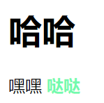
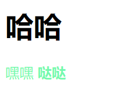
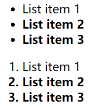
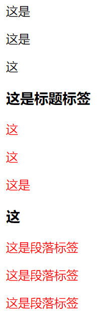
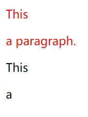

其他选择器
==================================

CSS中选择器除了id选择器和类选择器外还有复合选择器，属性选择器和伪类选择器等。

复合选择器（交集选择器与并集选择器）
~~~~~~~~~~~~~~~~~~~~~~~~~~~~~~~~~~~~~~

交集选择器
+++++++++++++

交集选择器由两个选择器构成，找到的标签必须满足：既有标签一的特点，也有标签二的特点。

用法： 标签选择器.class选择器{属性：属性值；}

用的相对来说比较少，不太建议使用.

并集选择器
+++++++++++++++++

如果某些选择器定义的相同样式，就可以利用并集选择器，可以让代码更简洁。

并集选择器（CSS选择器分组）是各个选择器通过,连接而成的，通常用于集体声明。

任何形式的选择器（包括标签选择器、class类选择器id选择器等），都可以作为并集选择器的一部分。

用法： 选择器1，选择器2{属性： 属性值；}

举个例子：

.. code-block:: css
    :linenos:

    h1,h2 {color: red;}

h1,h2标签的都会是红色的。

关系选择器（父子、后代、祖先、兄弟）
~~~~~~~~~~~~~~~~~~~~~~~~~~~~~~~~~~~~~~

**后代选择器（包含选择器）**

作用：用来选择元素或元素组的子孙后代。

其写法就是把外层标签写在前面，内层标签写在后面，中间用空格分隔，先写父亲爷爷，在写儿子孙子。

用法： 父级 子级{属性:属性值;属性:属性值;}

当标签发生嵌套时，内层标签就成为外层标签的后代。

子孙后代都可以这么选择。 或者说，它能选择任何包含在内的标签。

举个栗子：

.. code-block:: html
    :linenos:

    <!DOCTYPE html>
    <html>
    <head>
    <meta charset="utf-8">
    
    </head>
    <body>
    

        <h1>哈哈</h1>
        
嘿嘿 <b>哒哒</b>

    

    </body>
    </html>

运行结果如图一所示：

  运行结果

**父子选择器**

作用：子元素选择器只能选择作为某元素子元素(亲儿子)的元素（与后代选择器区分开--后代选择器还可以有孙子，曾孙子等）。

其写法就是把父级标签写在前面，子级标签写在后面，中间跟一个 > 进行连接。

用法：父级>子级{属性:属性值;属性:属性值;}

举个例子：

.. code-block:: html
    :linenos:

    <!DOCTYPE html>
    <html>
    <head>
    <meta charset="utf-8">
    
    </head>
    <body>
    

        <h1>哈哈</h1>
        
嘿嘿 <b>哒哒</b>

    

    </body>
    </html>

运行结果如图二所示：

  运行结果

**兄弟选择器**

如果需要选择紧接在另一个元素后的元素，而且二者有相同的父元素，可以使用相邻兄弟选择器（

用法： 

1、相邻兄弟选择器使用了加号（+），即相邻兄弟结合符。表示某元素后相邻的兄弟元素，也就是紧挨着的，是单个的。

注意： 用一个结合符只能选择两个相邻兄弟中的第二个元素。

2、使用“ ~ ”，表示某元素后所有同级的指定元素，强调所有的。

举个例子：

.. code-block:: html
    :linenos:

    <!DOCTYPE HTML>
    <html>
    <head>
    
    </head>
    <body>
    

    <ul>
        <li>List item 1</li>
        <li>List item 2</li>
        <li>List item 3</li>
    </ul>
    <ol>
        <li>List item 1</li>
        <li>List item 2</li>
        <li>List item 3</li>
    </ol>
    

    </body>
    </html>

运行结果如图三所示

  运行结果

结果解释： li+li的理解是： 寻找li后面的li兄弟，所以找到了第一个li时就往后看看他的li兄弟（即为第二个li和第三个li）。

再来一个例子：

.. code-block:: html
    :linenos:

    <!DOCTYPE html>
    <html lang="en">
    <head>
    <meta charset="UTF-8">
    <title>Document</title>
    
    </head>
    <body>
    
这是

    
这是

    
这

    <h3 class="h1">这是标题标签</h3>
    
这

    
这

    
这是

    <h3>这</h3>
    
这是段落标签

    
这是段落标签

    
这是段落标签

    </body>
    </html>

运行结果如图四所示：

  运行结果

属性选择器
~~~~~~~~~~~~~~~~~~~~~~~~~~~~~~~~~~~~~~

属性选择器可以根据元素的属性及属性值来选择元素。

用法：

1、\*[元素] {属性：属性值；}

2、元素[属性1][属性2]{属性： 属性值}(支持单个或多个属性）

3、可以对所有带有 alt 属性的图像应用样式，从而突出显示这些有效的图像。

例如：

.. code-block:: css
    :linenos:

    image[alt] {border: 5px solid blue;}

运行的结果则为图像加上了红色边框。

但这种用法更多的用于诊断图像是否正常显示出来，而非为了设计。

4、元素[属性=属性值]{属性：属性值；}

5、可以把多个属性-值选择器链接在一起来选择一个文档。元素[属性1=属性值1][属性2=属性值2]{属性：属性值；}

6、如果需要根据属性值中的词列表的某个词进行选择，则需要使用波浪号（~）。

例如：

.. code-block:: html
    :linenos:

    <!DOCTYPE html >
    <html>
    <head>
    
    </head>
    <body>
    
This </a>
    
 a paragraph.</a>
    
This </a>
    
a

    </body>
    </html>

运行结果如图五所示

  运行结果

伪类选择器
~~~~~~~~~~~~~~~~~~~~~~~~~~~~~~~~~~~~~~

伪类
+++++++++++++++++

伪类用于定义元素的特殊状态（①设置鼠标悬停在元素上时的样式②为已访问和未访问链接设置不同的样式③设置元素获得焦点时的样式）

用法：选择器:伪类{属性： 属性值;}

常见伪类有：(所有伪类详见https://www.w3school.com.cn/css/css_pseudo_classes.asp）

.. list-table::
   :widths: 20 20
   :header-rows: 1

   * - :active
     - 选择活动的链接

   * - :empty
     - 选择没有子元素的每个 
 元素

   * - :enabled
     - 选择每个已启用的 <input> 元素

   * - :focus
     - 	选择获得焦点的 <input> 元素

   * - :hover
     - 选择鼠标悬停其上的链接

举个例子：

.. code-block:: css
    :linenos:

    /* 未访问的链接 */
    a:link {
        color: #FF0000;
    }

    /* 已访问的链接 */
    a:visited {
        color: #00FF00;
    }

    /* 鼠标悬停链接 */
    a:hover {
        color: #FF00FF;
    }

    /* 已选择的链接 */
    a:active {
        color: #0000FF;
    }

注意：a:hover 必须在 CSS 定义中的 a:link 和 a:visited 之后，才能生效！a:active 必须在 CSS 定义中的 a:hover 之后才能生效  

优先级判断
~~~~~~~~~~~~~~~

由CSS的样式权值决定，这是一种覆盖原则。

样式权值高的覆盖权值低的，一般情况样式层级定位越多（定位越准确），相对权值越高，越不容易被覆盖。

权值表如下表所示：

.. list-table::
   :widths: 20 20
   :header-rows: 1

   * - CSS选择器
     - 权值

   * - 标签选择器
     - 1

   * - 类选择器
     - 10

   * - ID选择器
     - 100

   * - 内联样式
     - 1000

   * - 伪元素(:first-child等)
     - 1

   * - 伪类(:link等)
     - 10

拓展： 实际上这个100是一个进制数，不是2进制，也不是10进制；而是256进制，就是0到255后+1才是1。

