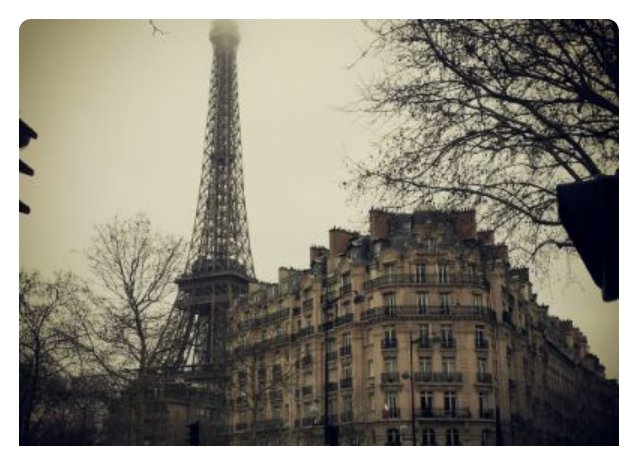
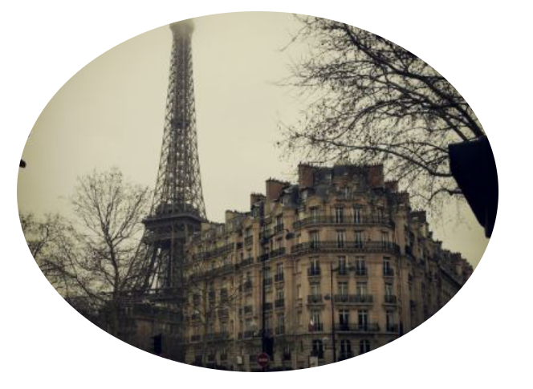
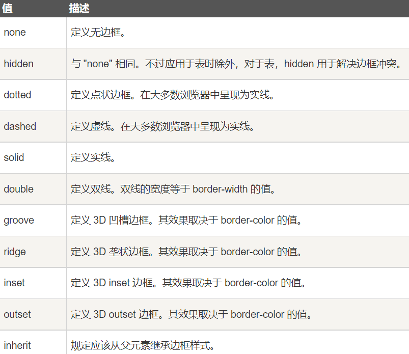
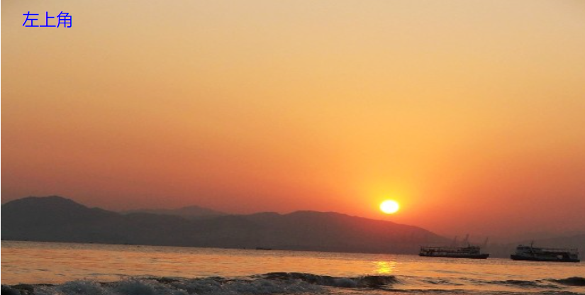
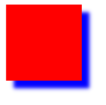
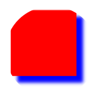
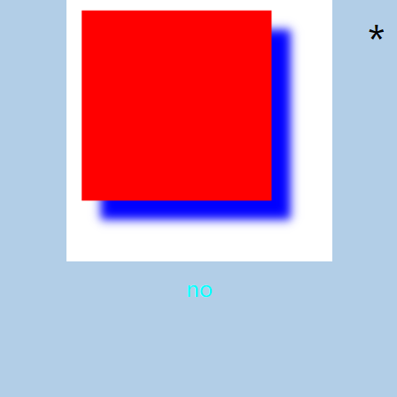

图片
===================================

圆角图片
~~~~~~~~~~~~~

border-radius属性用于定义圆角图片的圆角半径。

用法：1、 border-radius： 多少像素值;(eg: 7px....)

可以简便设置四个值：分别为左上、右上、右下、左下；

如果设置三个值：分别为左上、右上/左下、右下；

如果设置两个值：左上/右下、右上/左下；

如果设置一个值：设置四个角同样的值。

示例： 

.. code-block:: css
    :linenos:

    img {
        border-radius: 8px;
    }

呈现效果如图一所示： 

    
    呈现效果

椭圆形图片
~~~~~~~~~~~~

同样也使用border-radius。 

用法： border-radius： 百分比;(此处百分比意思为： 其实就是一个以宽百分之几及高百分之几为半径的椭圆顶格放置在四个边角后所呈现的弧度）

示例： 

.. code-block:: css
    :linenos:

    img {
        border-radius: 50%;
    }

呈现效果如图二所示： 

    
    呈现效果

缩略图
~~~~~~~~~~~~~~

border 属性用来创建缩略图。

border 简写属性在一个声明设置所有的边框属性。

可以按顺序设置如下属性：（他们的属性值顺序都为： 上，右，下，左）

border-width
border-style
border-color

如果不设置其中的某个值，也不会出问题。

属性如表所示： 

.. list-table::
   :widths: 20 20
   :header-rows: 1

   * - 属性
     - 描述

   * - border-width
     - 规定边框的宽度

   * - border-style
     - 	规定边框的样式

   * - border-color
     - 规定边框的颜色

   * - inherit
     - 规定应该从父元素继承 border 属性的设置

**border-width**

border-width为元素的所有边框设置宽度，或者单独地为各边边框设置宽度，只有当边框样式不是 none 时才起作用。如果边框样式是 none，边框宽度实际上会重置为 0。不允许指定负长度值。

用法： border-width： 上边框样式 右边框样式 下边框样式 左边框样式

border-width可能的属性值如图表三所示：

.. figure:: media/图片/5.63.png
    :align: center
    :alt: error
    
    border-width的属性值

**border-style**

border-style属性设置一个元素的四个边框的样式。此属性可以有一到四个值。

用法： border-style： 上边框样式 右边框样式 下边框样式 左边框样式

border-style可能的属性值如图表四所示：

    
    border-style的属性值

响应式图片
~~~~~~~~~~~~~~~~

如果你需要自由缩放图片，且图片放大的尺寸不大于其原始的最大值，可以选择如下处理：

.. code-block:: css
    :linenos:

    img {
        max-width: 100%;
        height: auto;
    }

图片文本
~~~~~~~~~~~~~~

具体可以参照： 6.3节定位。

在与该文本相对应的选择器里设置相应的位置属性。

举个例子：

.. code-block:: html
    :linenos:

    <!DOCTYPE html>
    <html>
    <head>
    <meta charset="utf-8">
    
    </head>
    <body>
    

        </img>
        
左上角

    

    </body>
    </html>

运行结果如图五所示

    
    运行结果

卡片式图片
~~~~~~~~~~~~~~~~~~

在与该卡片文本相对应的选择器里设置相应的位置属性，同时设置图片阴影。

**图片阴影设置**

box-shadow 属性向框添加一个或多个阴影。

用法： box-shadow: h-shadow v-shadow blur spread color inset;

其中h-shadow是必需的，指水平阴影的位置，允许负值。v-shadow是必需的，指垂直阴影的位置，允许负值。
blur指模糊距离。spread指阴影的尺寸。color指阴影的颜色。inset指将外部阴影 (outset) 改为内部阴影。

示例： 

.. code-block:: html
    :linenos:

    <head>
    
    </head>
    <body>
        

    </body>

运行结果如图六所示： 

    
    运行结果

图片滤镜
~~~~~~~~~~~~~~~

CSS filter 属性用为元素添加可视效果。

注： Internet Explorer 或 Safari 5.1 (及更早版本) 不支持该属性。

用法： filter: 滤镜;

如需使用多个滤镜，请用空格分隔每个滤镜。

常用的滤镜如下表所示： 

.. list-table::
   :widths: 20 20
   :header-rows: 1

   * - 滤镜
     - 描述

   * - none
     - 默认值，规定无效果

   * - blur(px)
     - 对图像应用模糊效果。较大的值将产生更多的模糊。
       如果为指定值，则使用 0。

   * - brightness(%)
     - 调整图像的亮度。
       0％ 将使图像完全变黑。
       默认值是 100％，代表原始图像。
       值超过 100％ 将提供更明亮的结果。

   * - contrast(%)
     - 调整图像的对比度。
       0％ 将使图像完全变黑。
       默认值是 100％，代表原始图像。
       超过 100％ 的值将提供更具对比度的结果

   * - drop-shadow(h-shadow v-shadow blur spread color)
     - 对图像应用阴影效果。（类似： box-shadow）
       可能的值：
       h-shadow - 必需。指定水平阴影的像素值。负值会将阴影放置在图像的左侧。
       v-shadow - 必需。指定垂直阴影的像素值。负值会将阴影放置在图像上方。
       blur -可选。这是第三个值，单位必须用像素。为阴影添加模糊效果。值越大创建的模糊就越多（阴影会变得更大更亮）。不允许负值。如果未规定值，会使用 0（阴影的边缘很锐利）。   
       spread - 可选。这是第四个值，单位必须用像素。正值将导致阴影扩展并增大，负值将导致阴影缩小。如果未规定值，会使用 0（阴影与元素的大小相同）。（注：Chrome、Safari 和 Opera，也许还有其他浏览器，不支持第 4 个长度；如果添加，则不会呈现）
       color - 可选。为阴影添加颜色。如果未规定，则颜色取决于浏览器（通常为黑色）

   * - grayscale(%)
     - 将图像转换为灰阶。
       0% (0) 是默认值，代表原始图像。
       100％ 将使图像完全变灰（用于黑白图像）

   * - hue-rotate(deg)
     - 在图像上应用色相旋转。该值定义色环的度数。默认值为 0deg，代表原始图像（最大值是： 360deg）

   * - invert(%)
     - 反转图像中的样本。
       0% (0) 是默认值，代表原始图像。
       100％将使图像完全反转。

   * - url()
     - url() 函数接受规定 SVG 滤镜的 XML 文件的位置，并且可以包含指向特定滤镜元素的锚点。
       eg： filter: url(svg-url#element-id)

图片 Modal(模态)
~~~~~~~~~~~~~~~~~~

需要结合Javascript一起渲染图片。

步骤：

- 首先用html设定好初始待点击的图片

- 定义model窗口的各种元素（包括内容区域和关闭按钮）。

- 然后用CSS设计图片的样式，以及鼠标悬停时的样式。

- 为图片的模态框定义部分样式，默认隐藏。

- 设置好页面的样式后，在脚本中给图片添加点击事件，让其点击的时候显示模态框。

示例如下： 

.. code-block:: html
    :linenos:

    <!DOCTYPE html>
    <html>
    <head>
        <meta charset="utf-8">
        <title>test</title>
        
    </head>
      <body>
        
        

            *
            
            

        

        
        </body>
    </html>

点击前运行结果如图七所示： 

        
    点击前

点击后运行结果如图八所示： 

        
    点击后

图片廊
~~~~~~~~~~~~~~

通常将多张图片定义同样的类名，通过类选择器来控制多张图片的样式，以及一些响应式操作。

