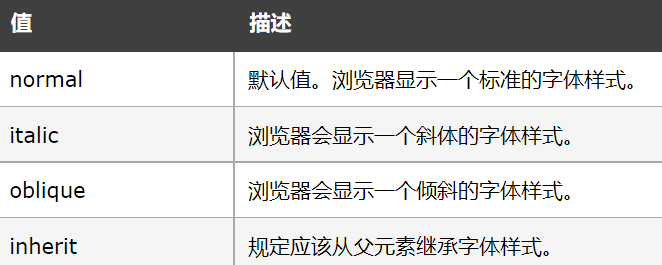
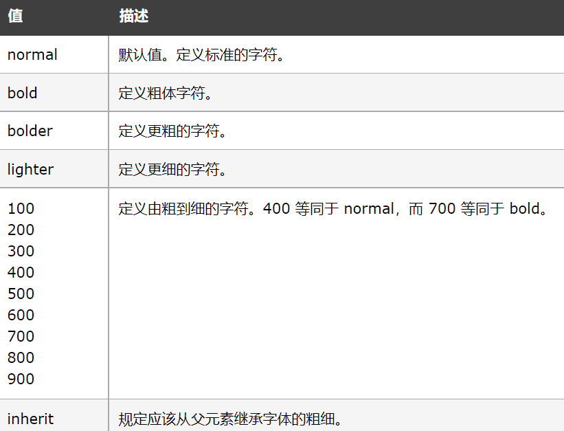
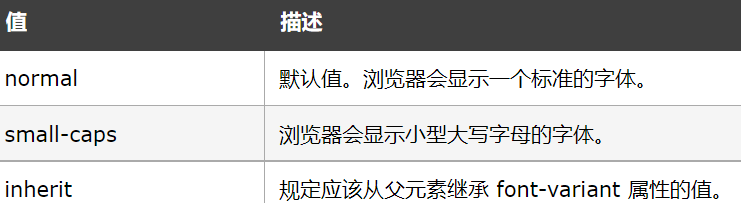
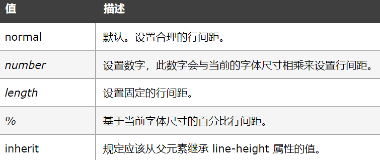
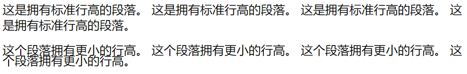

字体
======================================================================

在CSS中，有两种类型的字体系列名称：

通用字体系列 ---- 拥有相似外观的字体系统组合（如 "Serif" 或 "Monospace"）

特定字体系列 ---- 一个特定的字体系列（如 "Times" 或 "Courier"）

字体颜色（color）与字体大小（font-size）
~~~~~~~~~~~~~~~~~~~~~~~~~~~~~~~~~~~~~~~~~~~~~~~~~~~~~~~~~~~~~~~~~~~~~~

**字体颜色**

由color控制，示例： color: #F00;（字体为红色）。

**字体大小**

font-size 属性设置文本的大小。font-size 值可以是绝对或相对大小，有四种设置字体大小的方法。

绝对尺寸：

将文本设置为指定大小

不允许用户在所有浏览器中更改文本大小（可访问性不佳）

当输出的物理尺寸已知时，绝对尺寸很有用

相对尺寸：

设置相对于周围元素的大小

允许用户在浏览器中更改文本大小

注意： 如果没有指定字体大小，则普通文本（如段落）的默认大小为 16px（16px = 1em）。

方法一： 

以像素设置字体大小，示例：font-size: 40px;  

注意： 如果使用了像素，则仍然可以使用缩放工具来调整整个页面的大小。

方法二： 

用 em 设置字体大小（推荐使用）

1em 等于当前字体大小。浏览器中的默认文本大小为 16px。因此，默认大小 1em 为 16px。

示例： font-size: 2.5em;  （相当于40px，2.5*16 = 40）。

注意： 旧版本的 Internet Explorer 仍然存在问题。放大文本时它比应该大的尺寸更大，缩小文本时会更小。

方法三： 

使用百分比和 em 的组合

以 ％ 和 em 中设置字体大小会在所有主要浏览器中显示相同的大小，并允许所有浏览器调整文本大小。

示例：

.. code-block:: css
    :linenos:

    body {
        font-size: 100%;
    }
    h1 {
        font-size: 2.5em;
    }
    h2 {
        font-size: 1.875em;
    }

注： 百分比是相对于你设定的初始字体的，如果自己没有设定，则初始字体为浏览器默认字体。

方法四：

响应式字体大小

使用 vw 单位设置文本大小，它的意思是“视口宽度”。文本大小将遵循浏览器窗口的大小。

示例： 

.. code-block:: html
    :linenos:

    <h1 style="font-size:10vw">Hello </h1>

这样Hello的大小会随浏览器的窗口的大小而进行缩放。

字体格式（font-family）与字体样式（font-style）
~~~~~~~~~~~~~~~~~~~~~~~~~~~~~~~~~~~~~~~~~~~~~~~~~~~~~~~~~~~~~~~~~~~~~~

**font-family**

font-family规定元素的字体系列，可以把多个字体名称作为一个“回退”系统来保存。如果浏览器不支持第一个字体，则会尝试下一个。也就是说，font-family 属性的值是用于某个元素的字体族名称或/及类族名称的一个优先表。浏览器会使用它可识别的第一个值。

有两种类型的字体系列名称：

指定的系列名称：

具体字体的名称，比如："times"、"courier"、"arial"。

通常字体系列名称：比如："serif"、"sans-serif"、"cursive"、"fantasy"、"monospace"

注： 1、使用逗号分割每个值，并始终提供一个类族名称作为最后的选择。

2、使用某种特定的字体系列（Geneva）完全取决于用户机器上该字体系列是否可用；这个属性没有指示任何字体下载。因此，通常使用一个通用字体系列名作为后路

示例： p {font-family:"Times New Roman",Serif;}

**font-style**

font-style 属性定义字体的风格，该属性设置使用斜体、倾斜或正常字体。斜体字体通常定义为字体系列中的一个单独的字体。

用法： font-style: 属性值;

属性的可能值如图表一所示：

    
    font-style可能的属性值

示例： p {font-style:normal;}

字体粗细（font-weight）字体变体（font-variant）
~~~~~~~~~~~~~~~~~~~~~~~~~~~~~~~~~~~~~~~~~~~~~~~~~~~~~~~~~~~~~~~~~~~~~~

**font-weight**

font-weight 属性设置文本的粗细。数字值 400 相当于 关键字 normal，700 等价于 bold。每个数字值对应的字体加粗必须至少与下一个最小数字一样细，而且至少与下一个最大数字一样粗。

用法： font-weight: 属性值;

属性的可能值如图表二所示：

    
    font-weight可能的属性值

**font-variant**

font-variant 属性设置小型大写字母的字体显示文本，这意味着所有的小写字母均会被转换为大写，但是所有使用小型大写字体的字母与其余文本相比，其字体尺寸更小。

属性的可能值如图表三所示：

    
    font-variant可能的属性值

行高(line-height)
~~~~~~~~~~~~~~~~~~~~~~~~~~

line-height 属性设置行间的距离（行高）。

line-height 与 font-size 的计算值之差（在 CSS 中成为“行间距”）分为两半，分别加到一个文本行内容的顶部和底部。可以包含这些内容的最小框就是行框。

原始数字值指定了一个缩放因子，后代元素会继承这个缩放因子而不是计算值。

注：1、不允许使用负值。

2、该属性会影响行框的布局。在应用到一个块级元素时，它定义了该元素中基线之间的最小距离而不是最大距离。

属性的可能值如图表四所示：

    
    line-height可能的属性值

示例：

.. code-block:: html
    :linenos:

    <html>
    <head>
    
    </head>
    <body>
    

    这是拥有标准行高的段落。
    这是拥有标准行高的段落。
    这是拥有标准行高的段落。
    这是拥有标准行高的段落。
    

    

    这个段落拥有更小的行高。
    这个段落拥有更小的行高。
    这个段落拥有更小的行高。
    这个段落拥有更小的行高。
    

    </body>
    </html>

运行结果如图五所示：

    
    运行结果

字体的简写属性
~~~~~~~~~~~~~~~~~~~~~~~~~~~~~~~~~~~~~~~~~~~~~~~~~~~~~~~~~~~~~~~~~~~~~~

为了缩短代码，也可以在一个属性中指定所有单个字体属性。

font 属性是以下属性的简写属性：

font-style

font-variant

font-weight

font-size/line-height

font-family

注意： font-size 和 font-family 的值是必需的。如果缺少其他值之一，则会使用其默认值。

示例： p {font: 20px Arial, sans-serif;}

