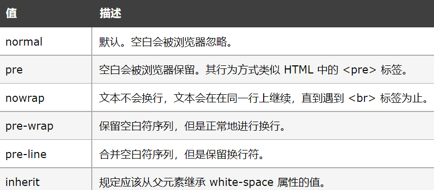

文本样式
==================================

文本对齐方式
~~~~~~~~~~~~~~~~~~~~~~~~~~~~~~~~~~~~~~~~~~~~~~~~~~~~~~~~~~~~~~~~~~~~~~

文本排列属性是用来设置文本的水平对齐方式。文本可居中或对齐到左或右,两端对齐。

通常用text-align来设置对齐方式.

可能的属性值如图表一所示：

    
    font-weight可能的属性值

用法： text-align： 属性值;

文本修饰
~~~~~~~~~~~~~~

text-decoration 属性用来设置或删除文本的装饰。

从设计的角度看 text-decoration属性主要是用来删除链接的下划线。

例如： 

.. code-block:: css
    :linenos:

    a {
        text-decoration: none;
    }

举个例子：

.. code-block:: html
    :linenos:

    <head>
    <meta charset="utf-8"> 
    
    </head>
    <body>
    <h1>This</h1>
    </body>

运行结果如图二所示：

    
    运行结果

文本转换
~~~~~~~~~~~~~

文本转换属性（text-transform）是用来指定在一个文本中的大写和小写字母。可用于所有字句变成大写或小写字母，或每个单词的首字母大写。

可能的属性值如图表三所示： 

    
    text-transform可能的属性值

举个例子： 

.. code-block:: html
    :linenos:

    <head>
    
    </head>
    <body>
    
This

    </body>

运行结果为THIS。

文本缩进
~~~~~~~~~~~~~

text-indent 属性规定文本块中首行文本的缩进。用于定义块级元素中第一个内容行的缩进。这最常用于建立一个“标签页”效果。允许指定负值，这会产生一种“悬挂缩进”的效果（如果使用负值，那么首行会被缩进到左边）。

用法： text-indent: 属性值;

可能的属性值如下表所示：

.. list-table::
   :widths: 20 20
   :header-rows: 1

   * - 值
     - 描述

   * - length
     - 定义固定的缩进。默认值：0

   * - %
     - 定义基于父元素宽度的百分比的缩进

   * - inherit
     - 规定应该从父元素继承 text-indent 属性的值

文本阴影
~~~~~~~~~~~~~~

text-shadow 属性向文本设置阴影，text-shadow能向文本添加一个或多个阴影。每个阴影有两个或三个长度值和一个可选的颜色值进行规定。省略的长度是 0

用法： text-shadow: h-shadow v-shadow blur color;

其中h-shadow是必需的，他指水平阴影的位置，允许是负值; v-shadow是必需的，他指垂直阴影的位置，允许是负值;blur是模糊的距离;color是阴影的颜色。

举个例子： text-shadow: 5px 5px 5px #FF0000;

他的效果如图四所示： 

    
    效果

处理空白
~~~~~~~~~~~~~~

white-space 属性设置如何处理元素内的空白。

用法：white-space: 属性值;

可能的属性值如图表五所示

    
    white-space的属性值

溢出
~~~~~~~~~~~~~~

**文本溢出**

text-overflow 属性规定当文本溢出包含元素时发生的事情。

用法： text-overflow: clip/ellipsis/string;

其中clip指修剪文本，ellipsis显示省略符号来代表被修剪的文本，string则是使用给定的字符串来代表被修剪的文本。

举个例子：

.. code-block:: html
    :linenos:

    <!DOCTYPE html>
    <html>
    <head>
    
    </head>
    <body>
    
This is a long time for me

    </body>
    </html>

运行结果如图六所示：

.. figure:: media/文本样式/5.46.png
    :align: center
    :alt: error
    
    运行结果

**内容溢出**

overflow 属性规定当内容溢出元素框时发生的事情。这个属性定义溢出元素内容区的内容会如何处理。如果值为 scroll，不论是否需要，用户代理都会提供一种滚动机制。因此，有可能即使元素框中可以放下所有内容也会出现滚动条。

可能的属性值如图表七所示

    
    overflow的属性值

