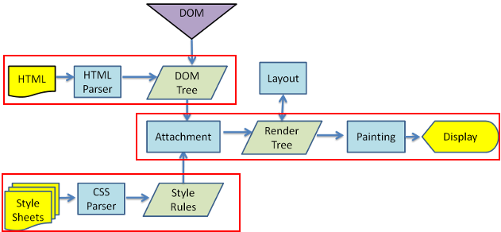

浏览器的默认样式
===================================

浏览器的默认样式
~~~~~~~~~~~~~~~~~~~~~~

每个浏览器都存在一套自己默认的CsSS样式表，为了保证没有样式表的页面能正常显示。

各浏览器默认样式详见http://www.360doc.com/content/11/0422/22/4800953_111647671.shtml

导入html，CSS文档后浏览器样式形成
~~~~~~~~~~~~~~~~~~~~~~~~~~~~~~~~~~~~~

1、浏览器加载了html后把html转化为dom树结构，完成对html的结构化。

补充说明： dom树结构（节点树结构） -- 一棵节点树中的所有节点彼此都是有关系的。每个元素即为一个节点。

举个例子：

.. code-block:: html
  :linenos:

  <html>
  <head>
    <title>DOM 节点树</title> 
  </head> 
  <body> 
  <h1>DOM </h1> 
  
H
 
  </body> 
  </html>

父节点和子节点： 除了文档节点（html）外，每个节点都有它对应的父节点。例如： <head>,<body>的父节点是<html>节点；<h1>和
的父节点是<body>节点。
对应的，<head>和<body>为<html>的子节点。

同级节点： 当节点分享同一个父节点时，它们就是同辈（同级节点）。例如： <h1>和
为同辈。

后代与先辈： 先辈：父亲，爷爷等；后代： 儿子，孙子等。依照上面的父节点和子节点的概念顺推。

2、对视图的渲染： 浏览器整合CSS，形成视图，以下为浏览器解析的路径。

解析路径如图一所示：

  浏览器解析的路径

开发网页时的重置
~~~~~~~~~~~~~~~~~~~~

通常我们在开发网页的时候，要考虑到不同的浏览器有不同的默认样式，如果不规定相对统一的样式，则有可能在某些浏览器中会导致页面崩溃。
因此我们常常需要重置浏览器默认样式。

避免浏览器兼容性的方法有： CSSReset（CSS重置）。

CSS重置就是由于各种浏览器解释CSS样式的初始值有所不同，导致设计师在没有定义某个CSS属性时，不同的浏览器会按照自己的默认值来为没有定义的样式赋值，所以我们要先定义好一些CSS样式，来让所有浏览器都按照同样的规则解释CSS，这样就能避免发生这种问题。

通常我们可以采用这种形式来定义： 

.. code-block:: css
  :linenos:

  * {
    margin: 0;
    padding:0;
  }

以下介绍几种其他的比较常见或实用的重置方法（也可以根据自己的需求来编写重置方法）：

示例一： 较为简单的CSS Reset

.. code-block:: css
  :linenos:

  * {
      outline: 0;
      padding: 0;
      margin: 0;
      border: 0;
   }

示例二： 该CSS重设方法出自Perishable Press

.. code-block:: css
  :linenos:

  * {
      vertical-align: baseline;
      font-weight: inherit;
      font-family: inherit;
      font-style: inherit;
      font-size: 100%;
      outline: 0;
      padding: 0;
      margin: 0;
      border: 0;
    }

示例三： Yahoo(YUI) CSS Reset方法。

.. code-block:: css
  :linenos:

    body,div,dl,dt,dd,ul,ol,li,h1,h2,h3,h4,h5,h6,pre, 
    form,fieldset,input,textarea,p,blockquote,th,td { 
        padding: 0; 
        margin: 0; 
    } 
    table { 
        border-collapse: collapse; 
        border-spacing: 0; 
    } 
    fieldset,img { 
        border: 0; 
    } 
    address,caption,cite,code,dfn,em,strong,th,var { 
        font-weight: normal; 
        font-style: normal; 
    } 
    ol,ul { 
        list-style: none; 
    } 
    caption,th { 
        text-align: left; 
    } 
    h1,h2,h3,h4,h5,h6 { 
        font-weight: normal; 
        font-size: 100%; 
    } 
    q:before,q:after { 
        content: ''; 
    } 
    abbr,acronym {
        border: 0; 
    }

还有更多方法详见: https://www.cnblogs.com/hnyei/archive/2011/10/04/2198779.html

总结： CSS重置浏览器默认样式，通常是去除边框，字体等大小设置为相对变换，去除一些标签的样式设计等。

再有一些比较个性化的设计时，最好是再重置一下该种元素的样式，以免未知的浏览器默认样式造成的影响。

注： 如果需要重置的样式比较多，比较杂，建议单独为重置写一个css文件。

