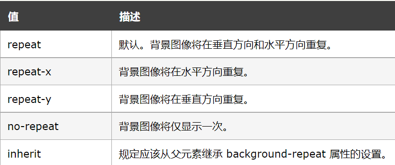

背景
===================================

CSS背景属性用于定义与描述网页背景呈现出来的效果。

background-color
~~~~~~~~~~~~~~~~~~~~~~~~~~~~~~~~~~~~~~~~~~~~~~~~~~~~~~~~~~~~~~~~~~~~~~

background-color用来定义背景的颜色。

用法： 选择器 {background-color: 颜色值;}

举个例子： 

.. code-block:: html
    :linenos:

    <!DOCTYPE html>
    <html>
    <head>
    <meta charset="utf-8">
    
    </head>
    <body>
    
哈哈

    </body>
    </html>

运行结果如图一所示：

    
    运行结果

background-image与background-size
~~~~~~~~~~~~~~~~~~~~~~~~~~~~~~~~~~~~~~~~~~~~~~~~~~~~~~~~~~~~~~~~~~~~~~

**background-image**

background-image用于导入背景图片。元素的背景占据了元素的全部尺寸，包括内边距和边框，但不包括外边距。

默认地，背景图像位于元素的左上角，并在水平和垂直方向上重复。

可能的属性值为

1、url('路径') -- 指向图像的路径.注意路径的写法。

2、none -- 默认值。不显示背景图像

3、inherit -- 规定应该从父元素继承 background-image 属性的设置。

**background-size**

background-size用于定义背景的大小（用于指定背景图像的大小）。

CSS3中可以指定背景图片，让我们重新在不同的环境中指定背景图片的大小。您可以指定像素或百分比大小。

当然，你指定的大小是相对于父元素的宽度和高度的百分比的大小，只能让背景图片放大缩小。

用法： 选择器 {background: url(图片网址或相对路径);}

选择器 {background-size: 大小值;}

background-repeat
~~~~~~~~~~~~~~~~~~~~~~~~~~~~~~~~~~~~~~~~~~~~~~~~~~~~~~~~~~~~~~~~~~~~~~

background-repeat 属性设置是否及如何重复背景图像，定义了图像的平铺模式。

默认地，背景图像在水平和垂直方向上重复。

用法：background-repeat: 属性值;

可能的属性值如图表二所示：

    
    background-repeat可能的属性值

background-attachment与background-position
~~~~~~~~~~~~~~~~~~~~~~~~~~~~~~~~~~~~~~~~~~~~~~~~~~~~~~~~~~~~~~~~~~~~~~

**background-attachment**

用于设置固定的背景图像。

用法： background-attachment： 属性值。

可能的属性值有：

1、scroll： 默认值。背景图像会随着页面其余部分的滚动而移动。

2、fixed： 当页面的其余部分滚动时，背景图像不会移动。

3、inherit： 规定应该从父元素继承 background-attachment 属性的设置。

**background-position**

设置背景图像的起始位置,即背景图像如果要重复，将从这一点开始。

注意： 需要把 background-attachment 属性设置为 "fixed"，才能保证该属性在 Firefox 和 Opera 中正常工作。

用法： background-position： 属性值;

可能的属性值如图表三所示：

    
    background-position可能的属性值

background-clip与background-origin
~~~~~~~~~~~~~~~~~~~~~~~~~~~~~~~~~~~~~~~~~~~~~~~~~~~~~~~~~~~~~~~~~~~~~~

**background-clip**

规定背景的绘制区域。

用法： background-clip: border-box / padding-box  / content-box;

其中，border-box 指背景被裁剪到边框盒；padding-box指背景被裁剪到内边距框。content-box指背景被裁剪到内容框。

如图五所示展示content-box的效果：

    
    content-box的效果

**background-origin**

background-origin 属性规定 background-position 属性相对于什么位置来定位。

注意： 如果背景图像的 background-attachment 属性为 "fixed"，则该属性没有效果。

用法： background-origin: padding-box / border-box / content-box;

其中，padding-box指背景图像相对于内边距框来定位；border-box指背景图像相对于边框盒来定位；content-box指背景图像相对于内容框来定位。

background
~~~~~~~~~~~~~~~~~~~~~~~~~~~~~~~~~~~~~~~~~~~~~~~~~~~~~~~~~~~~~~~~~~~~~~

看到这里你可能会觉得要每个属性都要写出“background-xx： 属性值；”有点麻烦。其实，CSS有background属性。

它可以实现在一个声明中设置所有背景属性。

用法： background： 属性值1 属性值2 属性值n;

举个例子：

.. code-block:: css
    :linenos:

    body
    { 
        background: #00FF00 url(bgimage.gif) no-repeat fixed top;
    }

