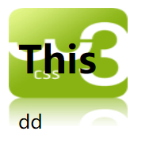

元素的层级
===================================

元素的层级指： 当元素开启定位后就会是元素提升一个层级,网页是由多个层级组成的。

如果定位元素的层级一样，则下边的元素会覆盖上边的元素（上下只与文档中的位置有关）

z-index（仅能应用于定位元素）属性指定了一个元素的堆叠顺序（哪个元素应该放在前面，或后面）

一个元素可以有正数或负数的堆叠顺序。具有更高堆叠顺序的元素总是在较低的堆叠顺序元素的前面

z-index值只决定同一父元素中的同级子元素的堆叠顺序。父元素的层级再高也不会盖住子元素。
父元素的z-index值（如果有）为子元素定义了堆叠顺序（css版堆叠“拼爹”）。（即父元素定义： position: relative;并且定义了层级）
向上追溯找不到含有z-index值的父元素的情况下，则可以视为自由的z-index元素。
它可以与父元素的同级兄弟定位元素或其他自由的定位元素来比较z-index的值，决定其堆叠顺序。
同级元素的z-index值如果相同，则堆叠顺序由元素在文档中的先后位置决定，后出现的会在上面。

注： 1、如果两个定位元素重叠，没有指定z - index，最后定位在HTML代码中的元素将被显示在最前面。

2、还有一点需要注意，负值的z-index也依照大小比较的原理，但一般来说负值的z-index会被透明的body覆盖导致点击等事件响应出现问题，请谨慎使用。

示例如下：

.. code-block:: html
    :linenos:

    <!DOCTYPE html>
    <html>
    <head>
    <meta charset="utf-8"> 
    <title>test</title> 
    
    </head>
    <body>
        <h1>This</h1>
        
        
dd

    </body>
    </html>

运行结果如图一所示： 

    
    运行结果