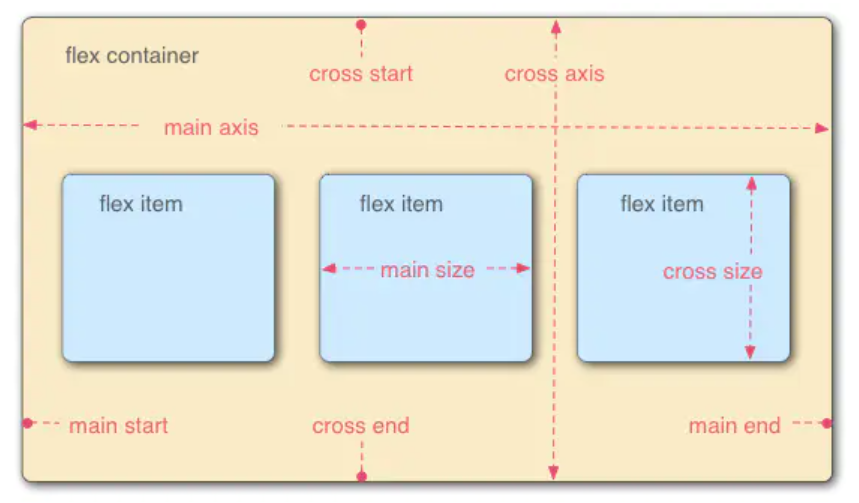
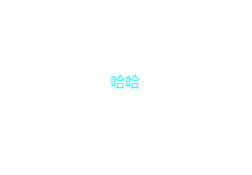

弹性盒flex
===================================================================

背景
~~~~~~~

在 Flexbox 布局模块（问世）之前，可用的布局模式有以下四种：

块（Block），用于网页中的部分（节）

行内（Inline），用于文本

表，用于二维表数据

定位，用于元素的明确位置

定义
~~~~~~~~~

弹性盒子是 CSS3 的一种新的布局模式。

CSS3 弹性盒（ Flexible Box 或 flexbox），是一种当页面需要适应不同的屏幕大小以及设备类型时确保元素拥有恰当的行为的布局方式。

引入弹性盒布局模型的目的是提供一种更加有效的方式来对一个容器中的子元素进行排列、对齐和分配空白空间，可以更轻松地设计灵活的响应式布局结构，而无需使用浮动或定位。

弹性盒子的相关定义如图一所示：

    
    弹性盒子的相关定义

其中，在弹性容器中，水平方向称为主轴(main axis)(起点main start,终点main end)；垂直方向称为纵轴(cross axis)(起点cross start,终点cross end)。

在弹性项目中，元素的宽度称为main size，高度称为cross size。

内容组成
~~~~~~~~~~~

弹性盒子由弹性容器(Flex container)和弹性子元素(Flex item)（也称为弹性项目）组成。

弹性容器内包含了一个或多个弹性子元素。

弹性容器外及弹性子元素内是正常渲染的。弹性盒子只定义了弹性子元素如何在弹性容器内布局。

弹性子元素通常在弹性盒子内一行显示。默认情况每个容器只有一行。

具体用法
~~~~~~~~~~~~~~

弹性容器通过设置 display 属性的值为 flex 或 inline-flex将其定义为弹性容器，flex容器将可拉伸。

flex容器属性
++++++++++++++++++

flex 容器属性有： flex-direction，flex-wrap，flex-flow，justify-content，align-items和align-content。

**flex-direction 属性**

flex-direction 属性定义容器要在哪个方向上堆叠 flex 项目。

注： display: flex;默认是水平堆叠弹性子元素（从左到右）。

可能的属性值如下表所示：

.. list-table::
   :widths: 20 20
   :header-rows: 1

   * - 属性值
     - 描述

   * - column
     - 设置垂直堆叠 flex 项目（从上到下）

   * - column-reverse
     - 垂直堆叠 flex 项目（但从下到上）

   * - row
     - 水平堆叠 flex 项目（从左到右）

   * - row-reverse
     - 水平堆叠 flex 项目（但从右到左）

**flex-wrap 属性**

flex-wrap 属性规定是否应该对 flex 项目换行。

可能的属性值如下表所示：

.. list-table::
   :widths: 20 20
   :header-rows: 1

   * - 属性值
     - 描述

   * - wrap 
     - 规定 flex 项目将在必要时进行换行

   * - nowrap
     - 规定将不对 flex 项目换行（默认）

   * - wrap-reverse
     - 规定如有必要，弹性项目将以相反的顺序换行

**flex-flow 属性**

flex-flow 属性是用于同时设置 flex-direction 和 flex-wrap 属性的简写属性。

用法： flex-flow: flex-direction属性值 flex-wrap属性值;

示例： 

.. code-block:: css
    :linenos:

    div {
        display: flex;
        flex-flow: row wrap;
    }

运行结果为div中的弹性子元素从左到右水平堆叠，必要时进行换行。

**justify-content 属性**

justify-content 属性用于对齐 flex 项目。

可能的属性值如下表所示：

.. list-table::
   :widths: 20 20
   :header-rows: 1

   * - 属性值
     - 描述

   * - center
     - 将 flex 项目在容器的中心对齐

   * - flex-start
     - 将 flex 项目在容器的开头对齐（默认）

   * - flex-end
     - 将 flex 项目在容器的末端对齐

   * - space-around
     - 显示行之前、之间和之后带有空格的 flex 项目

   * - space-between
     - 显示行之间有空格的 flex 项目

**align-items 属性**

align-items 属性用于垂直对齐 flex 项目。 

可能的属性值如下表所示：

.. list-table::
   :widths: 20 20
   :header-rows: 1

   * - 属性值
     - 描述

   * - center
     - 将 flex 项目在容器的中心对齐

   * - flex-start
     - 将 flex 项目在容器顶部对齐

   * - flex-end
     - 将弹性项目在容器底部对齐

   * - stretch
     - 拉伸 flex 项目以填充容器（默认）

   * - baseline
     - 使 flex 项目基线对齐

**align-content 属性**

align-content 属性用于对齐弹性线.

属性值有：

- stretch - 默认。各行将会伸展以占用剩余的空间。

- flex-start - 各行向弹性盒容器的起始位置堆叠。

- flex-end - 各行向弹性盒容器的结束位置堆叠。

- center -各行向弹性盒容器的中间位置堆叠。

- space-between -各行在弹性盒容器中平均分布，显示的弹性线之间有相等的间距。

- space-around - 各行在弹性盒容器中平均分布，两端保留子元素与子元素之间间距大小的一半。

**属性应用： 完美居中**

将 justify-content 和 align-items 属性设置为居中，即可完成完美居中。

示例如下：

.. code-block:: html
    :linenos:

    <!DOCTYPE html>
    <html>
    <head>
    
    </head>
    <body>
        

            

        

    </body>
    </html>

运行结果如图二所示： 

    
    运行结果 

其他局中方法： 

.. code-block:: css
  :linenos:

  position: absolute;
  top: 50%;
  left: 50%;
  transform: translate(-50%, -50%);

注释： 当使用：top: 50%;left: 50%;， 是以左上角为原点，故不处于中心位置。
translate(-50%,-50%) 作用是，往上（x轴）,左（y轴）移动自身长宽的 50%，以使其居于中心位置。

弹性项目属性
+++++++++++++++

用于弹性项目的属性有： order，flex-grow，flex-shrink，flex-basis，flex和align-self

**order属性**

order 属性规定 flex 项目的顺序，order 值必须是数字，默认值是 0。 

用法： style = "order: 数字";

示例

.. code-block:: html
    :linenos:

    
1

    
2

    
3
 

最后的排列时： 3 1 2。

**flex-grow属性**

flex-grow 属性规定某个 flex 项目相对于其余 flex 项目将增长多少。该值必须是数字，默认值是 0。 

示例： 

.. code-block:: html
    :linenos:

    
1

    
2

    
3
 

运行结果如图三所示：

    
    运行结果 

**flex-shrink 属性**

规定某个 flex 项目相对于其余 flex 项目将收缩多少，属性值必须是数字，默认值为0。

用法： style = "flex-shrink: 数字";

**flex-basis 属性**

规定 flex 项目的初始长度。

用法： style = "flex-basis: 数字";

**flex 属性**

是 flex-grow、flex-shrink 和 flex-basis 属性的简写属性。

用法： style = "flex: flex-grow属性值 flex-shrink属性值 flex-basis属性值";

**align-self 属性**

align-self 属性规定弹性容器内所选项目的对齐方式。

align-self 属性将覆盖容器的 align-items 属性所设置的默认对齐方式。

用法： style = "align-self: 大部分同align-items属性值";

