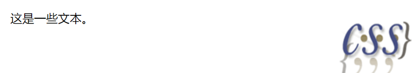

浮动
===================================

定义
~~~~~~~~~~~~

CSS 的 Float（浮动），会使元素向左或向右移动，其周围的元素也会重新排列。
Float（浮动），往往是用于图像，但它在布局时一样非常有用。

元素的水平方向浮动，意味着元素只能左右移动而不能上下移动。

一个浮动元素会尽量向左或向右移动，直到它的外边缘碰到包含框或另一个浮动框的边框为止。

浮动元素之后的元素将围绕它。浮动元素之前的元素将不会受到影响。

属性float
~~~~~~~~~~~~~~~~~~

float 属性定义元素在哪个方向浮动。往往这个属性总应用于图像，使文本围绕在图像周围，不过在 CSS 中，任何元素都可以浮动。浮动元素会生成一个块级框，而不论它本身是何种元素。

如果浮动非替换元素，则要指定一个明确的宽度；否则，它们会尽可能地窄。

注： 1、假如在一行之上只有极少的空间可供浮动元素，那么这个元素会跳至下一行，这个过程会持续到某一行拥有足够的空间为止。

2、如果你把几个浮动的元素放到一起，如果有空间的话，它们将彼此相邻。

用法： float: 属性值;

可能的属性值如下表所示：

.. list-table::
   :widths: 20 20
   :header-rows: 1

   * - 属性值
     - 描述

   * - left
     - 元素向左浮动

   * - right
     - 元素向右浮动

   * - none
     - 默认值，元素不浮动，并会显示在其在文本中出现的位置

   * - inherit
     - 规定应该从父元素继承 float 属性的值

示例如下：

.. code-block:: html
    :linenos:

    <!DOCTYPE html>
    <html>
    <head>
    <meta charset="utf-8"> 
    <title>test</title>
    
    </head>
    <body>
        
        这是一些文本。
    </body>
    </html>

运行结果如图一所示： 

    
    运行结果

清除浮动
~~~~~~~~~~~~~~

元素浮动之后，周围的元素会重新排列，为了避免这种情况，使用 clear 属性。 

clear 属性指定元素两侧不能出现浮动元素。

常应用于图片廊间的文本。

举个例子：

.. code-block:: html
    :linenos:

    <!DOCTYPE html>
    <html>
    <head>
    <meta charset="utf-8"> 
    <title>test</title> 
    
    </head>
    <body>
        
        <h3 class="text">第二行</h3>
        
    </body>
    </html>

运行结果如图二所示：

    
    运行结果

