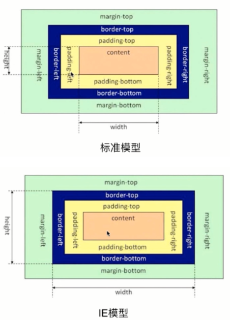
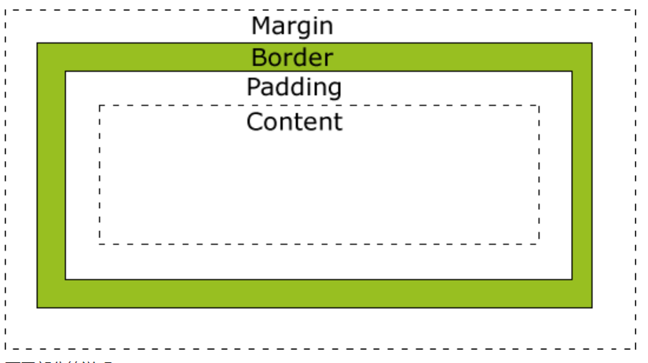
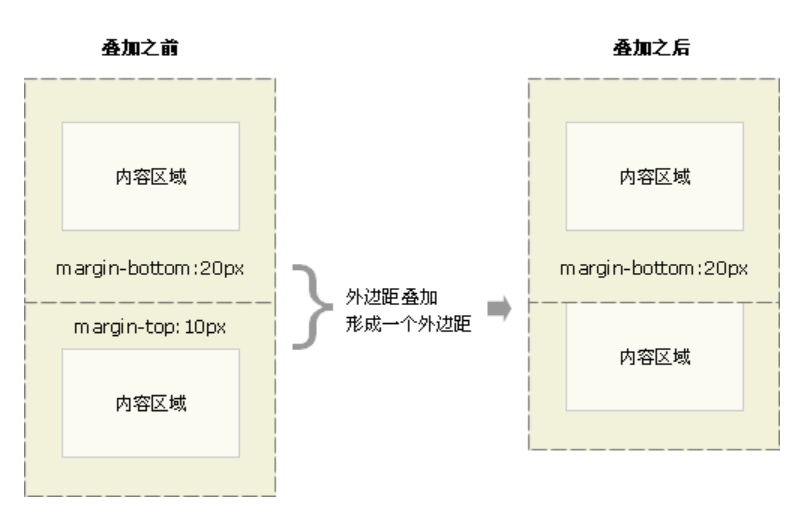
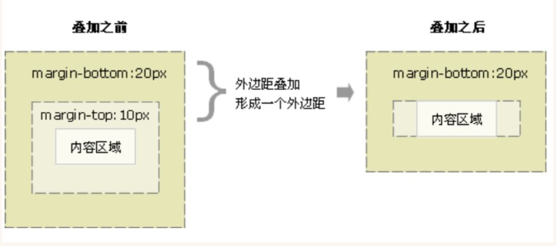
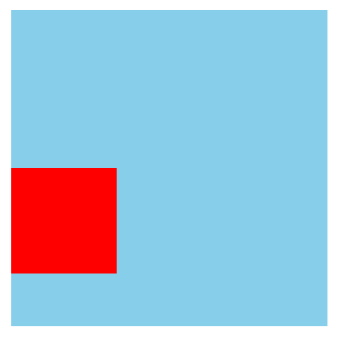
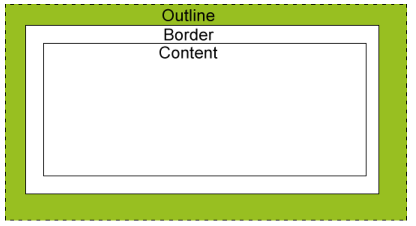

盒子模型
===================================

什么是盒子模型
~~~~~~~~~~~~~~~~~~~~~~~~~~~~~~~~~~~

所有HTML元素可以看作盒子，在CSS中，"box model"这一术语是用来设计和布局时使用。

CSS盒模型本质上是一个盒子，封装周围的HTML元素，它包括：边距，边框，填充，和实际内容。

盒模型允许我们在其它元素和周围元素边框之间的空间放置元素。

盒模型有两种标准：标准模型（W3C盒模型）、IE盒模型

在标准盒模型中，盒模型的宽高只是内容的宽高；

而在IE盒模型中，盒模型的宽高是内容（content）+padding+border;

标准盒模型模型：width=content，对象的实际宽度=width+padding+border+margin;

IE6盒子模型：width=content+padding+border;对象实际宽度=width+margin;

    标准盒模型与IE6盒子模型

盒子的组成（内容区content、内边距padding、边框border、外边距margin）
~~~~~~~~~~~~~~~~~~~~~~~~~~~~~~~~~~~~~~~~~~~~~~~~~~~~~~~~~~~~~~~~~~~~~~

盒子组成如图二所示：

    
    盒子组成

说明： 

- Margin(外边距) - 清除边框外的区域，外边距是透明的。

- Border(边框) - 围绕在内边距和内容外的边框。

- Padding(内边距) - 清除内容周围的区域，内边距是透明的。

- Content(内容) - 盒子的内容，显示文本和图像。

注： 当您指定一个 CSS 元素的宽度和高度属性时，你只是设置内容区域的宽度和高度。

盒子模型的水平布局与垂直布局（相关计算公式）
~~~~~~~~~~~~~~~~~~~~~~~~~~~~~~~~~~~~~~~~~~~~~~~~~~~~~~~~~~~~~~~~~~~~~~

**盒子的水平布局（横向布局）**

元素在其父元素中水平方向的布局由以下的几个属性共同决定

- margin-left  左外边距

- border-left 左边框

- padding-left 左内边距

- width 内容区宽度

- padding-right 右内边距

- border-right 右边框

- margin-right 右外边距

一个子元素在其父元素中，必须满足以下的等式： 

左外边距 + 左边框 + 左内边距 + 宽度 + 右内边距 + 右边框 + 右外边距 = 整体宽度

**盒子的垂直布局**

默认情况下父元素的高度被内容区撑开，子元素是在父元素的内容区内排列的，如果子元素的高度超过父元素的高度，子元素就会从父元素中溢出。

使用 overflow 属性来处理溢出的子元素。详见5.4节文本样式中的“内容溢出”。

其他属性：

overflow-x: 指定是否要剪辑的左/右边缘的内容和overflow-y：指定是否要剪辑顶部/底部边缘的内容

属性值：

- visible：可见，不剪裁内容，可能会显示在内容框之外

- hidden：剪裁内容，不滚动

- scroll：剪裁内容，有滚动条

- auto：自动

- no-display：不显示，如果内容不适合内容框，则删除整个框。

- no-content：如果内容不适合内容框，则隐藏整个内容。

overflow-wrap：用来说明当一个不能被分开的字符串太长而不能填充其包裹盒时，为防止其溢出，浏览器是否允许这样的单词中断换行。(是按照空格来区分每个单词）

属性值：

- normal：默认值，表示在正常单词结尾处换行

- break-word：表示如果行内没有多余的地方容纳该单词到结尾，则那些正常的不能被分割的单词会被强制分割换行。

overflow-block：设置内容溢出块开始和块结束边时显示的内容

属性值：

- none：不显示使程序段轴溢出的内容

- scroll：滚动，拖动滚动轴可以看到溢出的内容

- optional-paged：通过滚动块轴可以看到溢出的内容，但是可以手动触发分页符，使得以下内容现实在下一页上。

- paged：内容被拆分为多个页面，在下一页上显示在块轴上溢出一页的内容。

overflow-anchor：溢出锚点CSS属性提供了一种退出浏览器滚动锚定行为的行为的方式，该行为会调整滚动位置以最大程度减少内容的偏移。

属性值：

- auto：自动，调整滚动位置时，该元素将成为潜在的锚点。

- none：该元素将不会被选作为潜在的锚点。

盒子模型的外边距重叠（折叠）问题
~~~~~~~~~~~~~~~~~~~~~~~~~~~~~~~~~~~~~~~~~~~~~~~~~~~~~~~~~~~~~~~~~~~~~~

外边距重叠是指两个垂直相邻的块级元素，当上下两个边距相遇时，起外边距会产生重叠现象，且重叠后的外边距，等于其中较大者。（水平方向不会发生）

产生原因： 当一个元素包含另一个元素时，假设没有padding或border把外边距分隔开，他们的上/下外边距就会发生合并。 父元素的第一个子元素的上边距margin-top如果碰不到有效的border或者padding，就会不断地向上层寻找。如果给其父元素设置个有效的 border或者padding就可以避免这种情况。

相邻元素可为父子元素或同胞元素。

示例： 

**同胞元素**

    
    同胞元素外边距重叠

**父子元素**

        
    父子元素外边距重叠

折叠后的margin计算

1、margin都是正值时取较大的margin值
    
2、margin都是负值时取绝对值较大的，然后负向位移。
    
3、margin有正有负，从负值中选绝对值最大的，从正值中选取绝对值最大的，然后相加

解决方法：

1、设置为BFC布局

- 根元素

- float的值不为none

- overflow的值不为visible（hidden、auto、scroll）

- display的值为inline-block、table-cell、table-caption、flex

- position的值为absolute或fixed 　

2、对于父子元素，内层元素加 float:left或display:inline-block;

3、 内层元素绝对定位 position:absolute;

4、 外层父元素加透明边框 border:solid 1px transparent;

5、 改为padding。

举个例子：

.. code-block:: html
    :linenos:

    <!DOCTYPE html>
    <html>
    <head>
        <meta charset="utf-8"> 
        <title>test</title> 
    
    </head>
    <body>
	    

			

		

    </body>
    </html>

运行结果如图五所示： 

        
    运行结果

盒子的轮廓，阴影与圆角
~~~~~~~~~~~~~~~~~~~~~~~~~~~~~~~~~~~~~~~~~~~~~~~~~~~~~~~~~~~~~~~~~~~~~~

**盒子轮廓**

轮廓是绘制于元素周围的一条线，位于边框边缘的外围，可起到突出元素的作用。

轮廓属性指定元素轮廓的样式、颜色和宽度。

outline属性定义盒子轮廓，和border的使用方法一样，不一样的地方是outline不会影响可见框的大小。

如图六所示：

        
    盒子轮廓

outline用法： outline: 属性值1 属性值2 属性值n;

属性值如下表所示：

.. list-table::
   :widths: 20 20
   :header-rows: 1

   * - 属性值
     - 描述

   * - outline-color
     - 规定边框的颜色

   * - outline-style
     - 规定边框的样式

   * - outline-width
     - 规定边框的宽度

   * - inherit
     - 规定应该从父元素继承 outline 属性的设置

**盒子阴影**

box-shadow: 用来设置元素的阴影效果，阴影也不会影响页面布局。默认阴影和元素一样大。

用法详见5.6节图片中的图片阴影设置。

**盒子的圆角**

border-radius:用来设置圆角，圆角设置的圆的半径大小。可以设置两个值，第一个值设置水平半径，第二个值设置垂直半径。

用法等详见5.6节图片中的圆角图片。

行内元素的盒子模型
~~~~~~~~~~~~~~~~~~~~~~~~~~~~~~~~~~~~~~~~~~~
                
行内元素不支持设置宽度和高度
                
行内元素可以设置padding，但是垂直方向padding不会影响页面的布局

行内元素可以设置border，垂直方向的border不回影响页面的布局

行内元素可以设置margin，垂直方向的margin不会影响布局

**display**

display 用来设置元素显示的类型，其可能的属性值：

1、inline 将元素设置为行内元素
                        
2、block 将元素设置为块元素
                        
3、inline-block 将元素设置为行内块元素（行内块，既可以设置宽度和高度又不会独占一行）
                        
4、table 将元素设置为一个表格
                        
5、none 元素不在页面中显示

**visibility**

visibility 用来设置元素的显示状态，其可能的属性值： 
                        
1、visible 默认值，元素在页面中正常显示
                        
2、hidden 元素在页面中隐藏 不显示，但是依然占据页面的位置

示例： 

.. code-block:: html
    :linenos:

    <!DOCTYPE html>
    <html>
    <head>
    <meta charset="utf-8">
    <title>test</title>
    
    </head>
    <body>
	    Yes
    </body>
    /html>

运行结果如图七所示：

            
    运行结果

