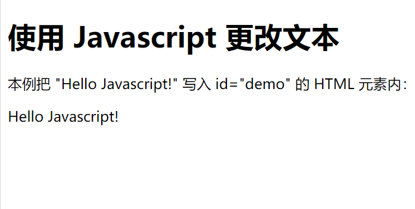

HTML中的CSS、Javascript
===========================================

在3.1. HTML、CSS与Javascript简述这一节中，我们已经知道，一个网页中，HTML是主体，CSS在HTML的基础上来描述网页的样子。

具体来说则为： CSS用于渲染HTML元素标签的样式。

CSS 可以通过以下方式添加到HTML中:

1、内联样式 ———— 在HTML元素中使用"style" 属性。

2、内部样式表 ———— 在HTML文档头部 <head> 区域使用
    </head>

**步骤**

1、指明style的类型（CSS）(这一步往往可以省略，直接写<style>即可）

2、在style元素中写下自己想设置的样式。

内联样式
~~~~~~~~~~~~~~~~~~~~~~~~~~~~~~~~~~~~~~~~~~~~~

当特殊的样式需要应用到个别元素时，就可以使用内联样式。 

以下实例显示出如何改变段落的颜色和左外边距。

.. code-block:: html
    :linenos:

    
这是一个段落。

**步骤**

使用内联样式的方法是在相关的标签中使用样式属性，样式属性可以包含任何 CSS 属性。（注意：写在最开始的标签上）

**补充**

CSS修饰标签的样式，有 "内联" 和 "外引" 两种方式。

对于大部分标签，用"内联"和"外引"两种方法均可，且修改父级标签，子级标签特性也会改变。但某些标签却无法通过修改父级标签来改变子级标签特性，如a标签，修改其颜色特性，必须直接修改 a 标签的特性才可。

例如：修改a标签的颜色属性。

.. code-block:: html 
    :linenos:

    <a href="#" style="color: red;" rel="nofollow">只能使用"内联"方式</a>

**三者之间的优先级**

内联形式 > 内部样式表 > 外部样式表

但是内部样式表 > 外部样式表有一个前提：内部样式表的位置一定在外部样式表的后面。

共同的前提： 内联形式、内部样式表、外部样式表中css样式是在相同权值的情况下。（关于权值的定义详见： 第4.4节“优先级判断”）

标签（标签内容里面写js语句）
~~~~~~~~~~~~~~~~~~~~~~~~~~~~~~~~~~~~~~~~~~~~~

JavaScript使HTML页面具有更强的动态和交互性。

将脚本插入html文档中需要使用 

运行结果如图1所示：

  图1-运行结果

其中，getElementById()方法可返回对拥有指定 ID 的第一个对象的引用；innerHTML属性设置或返回表格行的开始和结束标签之间的 HTML。

**拓展**

HTML <noscript> 标签定义了替代内容，这些内容将显示给在浏览器中禁用了脚本或浏览器不支持脚本的用户。

例如： 

.. code-block:: html
    :linenos:

    <!DOCTYPE html>
    <html>
    <body>
    

    
    <noscript>抱歉，您的浏览器不支持 JavaScript！</noscript>
    </body>
    </html>

在浏览器支持Javascript时呈现出“Hello Javascript！”，若浏览器不支持则显示“抱歉，您的浏览器不支持 JavaScript！”。