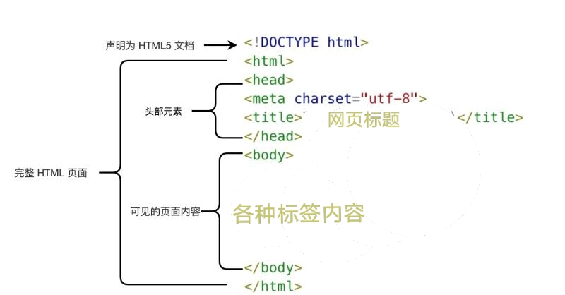
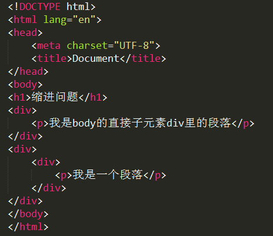

HTML的基本文档结构
============================================

文档基本结构写法
~~~~~~~~~~~~~~~~~~~~~~~~~~~~~~~~~~~~~~~~~~~~~

如图1所示为html文档的基本结构。

  图一：html文档的基本结构

文档类型声明部分<!DOCTYPE>
~~~~~~~~~~~~~~~~~~~~~~~~~~~~~~~~~~~~~~~~~~~~~

<!DOCTYPE>声明文档类型。它指示web浏览器关于页面使用哪个HTML版本进行编写的指令。<!DOCTYPE>规定了浏览器文档使用哪种html或者xhtml规范。

例如： <!DOCTYPE html> 声明为 HTML5 文档。

文档内容部分<html></html>
~~~~~~~~~~~~~~~~~~~~~~~~~~~~~~~~~~~~~~~~~~~~~

<html> 元素是 HTML 页面的根元素。此元素可告知浏览器其自身是一个 HTML 文档。<html> 与 </html> 标签限定了文档的开始点和结束点。

文档头部内容<head></head>
~~~~~~~~~~~~~~~~~~~~~~~~~~~~~~~~~~~~~~~~~~~~~

<head> 标签用于定义文档的头部，它是所有头部元素的容器。<head> 中的元素可以引用脚本、指示浏览器在哪里找到样式表、提供元信息等等。

文档的头部描述了文档的各种属性和信息，包括文档的标题、在 Web 中的位置以及和其他文档的关系等。绝大多数文档头部包含的数据都不会真正作为内容显示给读者。

<head> 元素包含了文档的元（meta）数据。例如： <meta charset="utf-8"> 定义网页编码格式为 utf-8。

标题元素<title></title>
~~~~~~~~~~~~~~~~~~~~~~~~~~~~~~~~~~~~~~~~~~~~~

<title> 元素描述了文档的标题。

文档主体元素<body></body>
~~~~~~~~~~~~~~~~~~~~~~~~~~~~~~~~~~~~~~~~~~~~~

<body> 元素包含了可见的页面内容，即包含文档的所有内容（比如文本、超链接、图像、表格和列表等等。）

基本结构代码格式化（vscode里 输入 “！”再按 回车）
~~~~~~~~~~~~~~~~~~~~~~~~~~~~~~~~~~~~~~~~~~~~~~~~~~~~~~~

1、文件应以<!DOCTYPE.....>首行顶格开始。

2、必须在head元素内部的meta标签内声明文档的字符编码charset。

3、保持良好的树形结构

每个块级元素都另起一行，每一行都用4个空格缩进对齐。若为行内元素，则把它写在一行上。

注意：html，head，body以及body下的第1级标签（即直接元素）不缩进，其他都正常缩进。

4、为每个逻辑功能块添加空行。

html文档的基本结构规范写法如图2所示：

  图二：html文档的基本结构规范写法