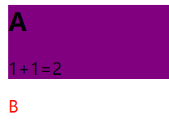

id与类
===========================================

对 HTML 进行分类（设置类），使我们能够为元素的类定义 CSS 样式，对HTML进行id设置，一方面与设置类一样可以对该元素做一些特殊的CSS样式定义，但更多的是应用于脚本（对某一个元素触发事件响应等）。

id
~~~~~~~~~~~~~~~

1、id 属性指定 HTML 元素的唯一 ID。 id 属性的值在 HTML 文档中必须是唯一的。

2、id 属性用于指向样式表中的特定样式声明。JavaScript 也可使用它来访问和操作拥有特定 ID 的元素。

3、id 的语法是：写一个井号 (#)，后跟一个 id 名称。然后，在花括号 {} 中定义 CSS 属性。

4、id 对大小写敏感，且必须包含至少一个字符，不能包含空白字符（空格、制表符等）。

5、在Javascript中运用id，可以使用 getElementById() 方法访问拥有特定 id 的元素。

举个例子：

.. code-block:: html
    :linenos:

    <head>
    
    </head>
    <body>
    <h1 id="my">My Header</h1>
    </body>

运行结果如图一所示：

  图1-运行结果

类
~~~~~~~~~~~~~~~

为相同的类设置相同的样式，或者为不同的类设置不同的样式。

通常有这两种形式：分类块元素和分类行内元素。

举个例子

.. code-block:: html
    :linenos:

    <head>
    
    </head>
    <body>
    

    <h2>A</h2>
    
1+1=2

    

    B 
    </body>

运行结果如图二所示：

    
    图2-运行结果

运用场景
~~~~~~~~~~~~

id用于特殊的标签上，因为这个部分就这么一个，没有与其他的地方重复的。

而class主要用于一类有同样特征的元素上。因为id只能用一次，class可以无限次使用。

