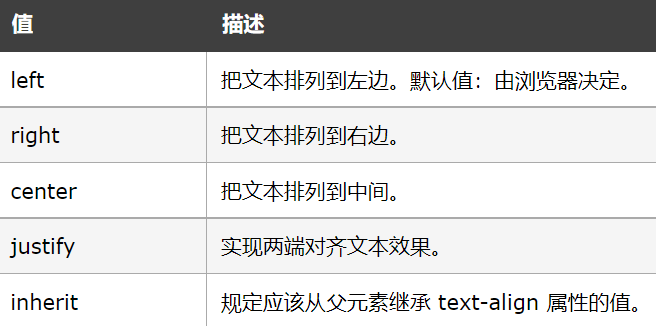

块元素与行内元素用法与区别
===================================

块元素
~~~~~~~~~~~~~~~

**特点及用法**

1、总是在新行上开始；

2、高度，行高以及外边距和内边距都可控制；

3、宽度缺省是它的容器的100%，除非设定一个宽度。

4、它可以容纳内联元素和其他块元素

**常见块元素**

如下表所示（详见https://www.cnblogs.com/yanqiu/p/8987126.html）

.. list-table::
   :widths: 20 20
   :header-rows: 1

   * - 标签
     - 描述

   * - <address>
     - 定义地址
     
   * - <article>
     - 定义文章

   * - <aside>
     - 定义页面内容之外的内容

   * - <audio>
     - 定义声音内容

   * - <blockquote>
     - 定义长的引用

   * - <canvas>
     - 定义图形

   * - <caption>
     - 定义表格标题

   * - <dd>
     - 定义自定义列表中项目的描述

   * - 

     - 定义文档中的节

   * - <dl>
     - 定义自定义列表

   * - <dt>
     - 定义自定义列表中的项目

   * - 

     - 定义元素的细节

   * - <fieldset>
     - 定义围绕表单中元素的边框

   * - <figure>
     - 定义媒介内容的分组，以及它们的标题

   * - <footer>
     - 定义 section 或 page 的页脚

   * - <form>
     - 定义供用户输入的 HTML 表单

   * - <h1> to <h6>
     - 定义 HTML 标题

   * - <header>
     - 定义 section 或 page 的页眉

   * - 

     - 定义水平线

   * - <legend>
     - 定义 fieldset 元素的标题

   * - <li>
     - 定义列表的项目

举个例子：

.. code-block:: html
    :linenos:

    <!DOCTYPE html>
    <html>
    <head> 
    <meta charset="utf-8"> 
    <title>test</title> 
    </head>
    <body>
    
这是一些文本。

    

        <h3>这是一个在 div 元素中的标题。</h3>
        
这是一个在 div 元素中的文本。

    

    
这是一些文本。

    </body>
    </html>

运行结果如图一所示：

  运行结果

行内元素
~~~~~~~~~~~~~~~

**特点及用法**

1、和其他元素都在一行上；

2、高，行高及外边距和内边距不可改变；

3、宽度就是它的文字或图片的宽度，不可改变；

4、内联元素只能容纳文本或者其他内联元素

**常见行内元素**

如下表所示（详见https://www.cnblogs.com/yanqiu/p/8987126.html）

.. list-table::
   :widths: 20 20
   :header-rows: 1

   * - <a>
     - 定义锚
  
   * - <abbr>
     - 定义缩写

   * - <b>
     - 定义粗体字

   * - <big>
     - 定义大号文本
  
   * -  
     - 定义简单的折行

   * - <button>
     - 定义按钮

   * - <code>
     - 定义计算机代码文本

   * - <em>
     - 定义强调文本

   * - 
     - 定义图像

   * - 
     - 定义文档中的节

   * - ...
     - ...

**注意**

1、设置宽度width 无效。

2、设置高度height 无效，可以通过line-height来设置。

3、设置margin 只有左右margin有效，上下无效。

4、设置padding 只有左右padding有效，上下则无效。注意元素范围是增大了，但是对元素周围的内容是没影响的。

块元素与行内元素的区别
~~~~~~~~~~~~~~~~~~~~~~~~~~~

如下表所示：

.. list-table::
   :widths: 20 20
   :header-rows: 1

   * - 块元素
     - 行内元素

   * - 主要用于页面布局
     - 主要用于选中文本设置样式

   * - 总是在新行上开始
     - 和其他元素都在一行上

   * - 高度，行高以及外边距和内边距都可控制
     - 高，行高及外边距和内边距不可改变

   * - 宽度缺省是它的容器的100%，除非设定一个宽度
     - 宽度就是它的文字或图片的宽度，不可改变

   * - 可以容纳内联元素和其他块元素
     - 内联元素只能容纳文本或者其他内联元素
  
拓展：块元素与行内元素的相互转换
~~~~~~~~~~~~~~~~~~~~~~~~~~~~~~~~~~~~

行内元素与块元素可以相互转换，通过修改display属性值来切换块元素和行内元素，行内元素display：inline，块元素display：block。

举个例子：

.. code-block:: html
    :linenos:

    

        哈哈
        
哒哒

    

这样就把块元素转化为行内元素。

转化意义： 可以设置原本不能使用的属性。例如行内元素不能设置宽度，转化为块级元素后就能设置宽度，可以更加个性化，合理化地进行调整。
