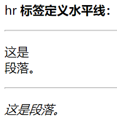

标签
===========================================

HTML标签是HTML语言中最基本的单位。更多详尽的标签详见https://www.w3school.com.cn/tags/tag_comment.asp

**特点**

1、HTML标签是由尖括号包围的关键词，例如： <html>。

2、HTML标签通常是成对出现的，例如： <b>和</b>。

3、标签对中的第一个标签为开始标签（开放标签），第二个标签为结束标签（闭合标签）。

4、呈现形式：<标签>内容</标签>。

自结束标签与成对标签
~~~~~~~~~~~~~~~~~~~~~~~~~~~~~~~~~~~~~~~~~~~~~

自结束标签（自闭合标签）单个出现，只能定义一些属性，不能插入别的标签或者内容。

**常见的自结束标签**

- meta：定义页面说明，方便网络引擎搜索
  
  例如： 

  .. code-block:: html
    :linenos:

    <meta charset = "utf-8">

- link:连接外部CSS文件或者脚本

  例如：

  .. code-block:: html
    :linenos:

    <link rel="stylesheet" type="text/css" href="mystyle.css">

- base：页面所有连接的基础定位(注意： 在一个文档中，最多能使用一个 <base> 元素。<base> 标签必须位于 <head> 元素内部。)

  例如： 

  .. code-block:: html
    :linenos:

    <base href="http://www.runoob.com/" target="_blank">    

- br：换行

  例如： 

  .. code-block:: html
    :linenos:

    
哈 哈

- hr:水平线

  例如： 

  .. code-block:: html
    :linenos:

    
HTML

    

    <h1>CSS</h1>

- input:定义表单元素

  例如： 

  .. code-block:: html
    :linenos:

    <input type="text" name="FirstName" value="Mickey">

- img:图像标签

  例如：

  .. code-block::
    :linenos:

    

一般标签都是成对标签，都是成对出现的，可以在中间插入内容。

标题标签 <h1></h1> 到 <h6></h6>
~~~~~~~~~~~~~~~~~~~~~~~~~~~~~~~~~~~~~~~~~~~~~

示例如下：

.. code-block:: html
    :linenos:

    <html>
    <body>
    <h1>This is heading 1</h1>
    <h2>This is heading 2</h2>
    <h3>This is heading 3</h3>
    <h4>This is heading 4</h4>
    <h5>This is heading 5</h5>
    <h6>This is heading 6</h6>
    </body>
    </html>

运行结果如图一所示：

  运行结果

注意：请仅仅把标题标签用于标题文本。不要仅仅为了产生粗体文本而使用它们。请使用其它标签或 CSS 代替。

段落标签，换行标签，水平线,粗体，斜体
~~~~~~~~~~~~~~~~~~~~~~~~~~~~~~~~~~~~~~~~~~~~~

段落标签

,换行标签 ,水平线
，粗体<b></b>,斜体<i></i>。

.. code-block:: html
    :linenos:

    <html>
    <body>
    
hr <b>标签定义水平线：</b>

    

    
<i>这是段落。<i>

    

    
这是 段落。

    </body>
    </html>

运行结果如图二所示：

  运行结果

链接标签 
~~~~~~~~~~~~~~~~~~~~~~~~~~~~~~~~~~~~~~~~~~~~~

<a> 标签定义超链接，用于从一张页面链接到另一张页面。<a> 元素最重要的属性是 href 属性，它指示链接的目标。

注：在所有浏览器中，链接的默认外观是：未被访问的链接带有下划线而且是蓝色的，已被访问的链接带有下划线而且是紫色的，活动链接带有下划线而且是红色的

例如： 

.. code-block:: html
  :linenos:

  <a href="https://www.baidu.com">百度</a>

运行结果： 单击“百度”字样即可进入百度网址。

注： href定义被链接文档的位置。<a>和</a>之间写的是该链接呈现出来文本。

图像标签 </img>
~~~~~~~~~~~~~~~~~~~~~~~~~~~~~~~~~~~~~~~~~~~~~

img 元素向网页中嵌入一幅图像。

请注意，从技术上讲， 标签并不会在网页中插入图像，而是从网页上链接图像。 标签创建的是被引用图像的占位空间。

 标签有两个必需的属性：src 属性 和 alt 属性。

基本用法： 

其他常用属性： height，width定义图像的大小。

文本标签 与盒子标签 

~~~~~~~~~~~~~~~~~~~~~~~~~~~~~~~~~~~~~~~~~~~~~~~~

**span**

 标签被用来组合文档中的行内元素。span 没有固定的格式表现。当对它应用样式时，它才会产生视觉上的变化。

举个栗子：

.. code-block:: html
  :linenos:

  
some text.some other text.

运行结果如图三所示：

  运行结果

.. code-block:: html
  :linenos:

  
some text.some other text.

运行结果如图四所示：

  运行结果

注： 

如果不对 span 应用样式，那么 span 元素中的文本与其他文本不会任何视觉上的差异。尽管如此，上例中的 span 元素仍然为 p 元素增加了额外的结构。
可以为 span 应用 id 或 class 属性，这样既可以增加适当的语义，又便于对 span 应用样式。

可以对同一个  元素应用 class 或 id 属性，但是更常见的情况是只应用其中一种。这两者的主要差异是，class 用于元素组（类似的元素，或者可以理解为某一类元素），而 id 用于标识单独的唯一的元素。

**div**

 可定义文档中的分区或节。它可以把文档分割为独立的、不同的部分。它可以用作严格的组织工具，并且不使用任何格式与其关联。如果用 id 或 class 来标记 
，那么该标签的作用会变得更加有效。
标签常用于组合块级元素，以便通过 CSS 来对这些元素进行格式化。通常与CSS结合。

用法： 

1、
 是一个块级元素。这意味着它的内容自动地开始一个新行。实际上，换行是 
 固有的唯一格式表现。可以通过 
 的 class 或 id 应用额外的样式。

2、根据实际场景判断是否要为每一个 
 都加上类或 id。

3、可以对同一个 
 元素应用 class 或 id 属性，但是更常见的情况是只应用其中一种。这两者的主要差异是，class 用于元素组（类似的元素，或者可以理解为某一类元素），而 id 用于标识单独的唯一的元素。

例如：

.. code-block:: html
    :linenos:

    <!DOCTYPE html>
    <html>
    <head> 
    <meta charset="utf-8"> 
    <title>test</title> 
    </head>
    <body>
    
这是一些文本。

    

        <h3>这是一个在 div 元素中的标题。</h3>
        
这是一个在 div 元素中的文本。

    

    
这是一些文本。

    </body>
    </html>

运行结果如图五所示：

  运行结果

列表标签<ol></ol>、<ul></ul>与<li></li>、<dl></dl>
~~~~~~~~~~~~~~~~~~~~~~~~~~~~~~~~~~~~~~~~~~~~~~~~~~~~~~~~~

HTML支持有序，无序和定义列表。

**HTML无序列表**

无序列表是一个项目的列表，此列项目使用粗体圆点（典型的小黑圆圈）进行标记。

无序列表使用 <ul> 标签。 

举个栗子：

.. code-block:: html
  :linenos:

  <ul>
  <li>Coffee</li>
  <li>Milk</li>
  </ul>

运行结果如图六所示：

  运行结果

**HTML有序列表**

同样，有序列表也是一列项目，列表项目使用数字进行标记。 有序列表始于 <ol> 标签。每个列表项始于 <li> 标签。列表项使用数字来标记。

举个栗子：

.. code-block:: html
  :linenos:

  <ol>
  <li>Coffee</li>
  <li>Milk</li>
  </ol>

运行结果如图七所示：

  运行结果

**HTML自定义列表**

自定义列表不仅仅是一列项目，而是项目及其注释的组合。

自定义列表以 <dl> 标签开始。每个自定义列表项以 <dt> 开始。每个自定义列表项的定义以 <dd> 开始。

举个栗子：

.. code-block:: html
  :linenos:

  <dl>
  <dt>A</dt>
  <dd>- black</dd>
  <dt>B</dt>
  <dd>- white</dd>
  </dl>

运行结果如图八所示：

  运行结果

常用文本格式化类的标签
~~~~~~~~~~~~~~~~~~~~~~~~

<b>粗体文本</b>

<code>计算机代码</code>

<em>强调文本</em>

<i>斜体文本</i>

<kbd>键盘输入</kbd> 

<pre>预格式化文本</pre>

<small>更小的文本</small>

<strong>重要的文本</strong>

链接标签
~~~~~~~~~~~~~~~~~~~~

普通的链接：<a href="http://www.example.com/">链接文本</a>

图像链接： 

邮件链接： <a href="mailto:webmaster@example.com">发送e-mail</a>

书签：

<a id="tips">提示部分</a>

<a href="#tips">跳到提示部分</a>

表格（table）
~~~~~~~~~~~~~~

<table> 标签定义 HTML 表格。

简单的 HTML 表格由 table 元素以及一个或多个 tr、th 或 td 元素组成。

tr 元素定义表格行，th 元素定义表头，td 元素定义表格单元。

更复杂的 HTML 表格也可能包括 caption、col、colgroup、thead、tfoot 以及 tbody 元素。

例如：

.. code-block:: html
  :linenos:

  <table border="1">
  <tr>
    <th>表格标题</th>
    <th>表格标题</th>
  </tr>
  <tr>
    <td>表格数据</td>
    <td>表格数据</td>
  </tr>
  </table>

其中border="1"表示该表格的边框线宽度为1px

运行结果如图九所示：

  
    运行结果

