Mysql的下载
------------------------------------

mysql简介
~~~~~~~~~~~~~~~~~~~~~~~

MySQL是一种关系型数据库管理系统，关系数据库将数据保存在不同的表中，而不是将所有数据放在一个大仓库内，这样就增加了速度并提高了灵活性。

MySQL所使用的 SQL 语言是用于访问数据库的最常用标准化语言。MySQL 软件采用了双授权政策，分为社区版和商业版，由于其体积小、速度快、总体拥有成本低，尤其是开放源码这一特点，一般中小型网站的开发都选择 MySQL 作为网站数据库。

下载和安装
~~~~~~~~~~~~~~~~~~~~~~~~~~

1. 进入mysql官网下载页面 https://dev.mysql.com/downloads/installer/, 该版本适用于win10系统,这里我们选择MySQL Installer for Windows, 下载页面中有两个安装包, 安装包都内容都一样, 但安装方式不同，这里我们以第二个安装包为例，离线安装包，选择不登录(No thanks，just start my download.)下载

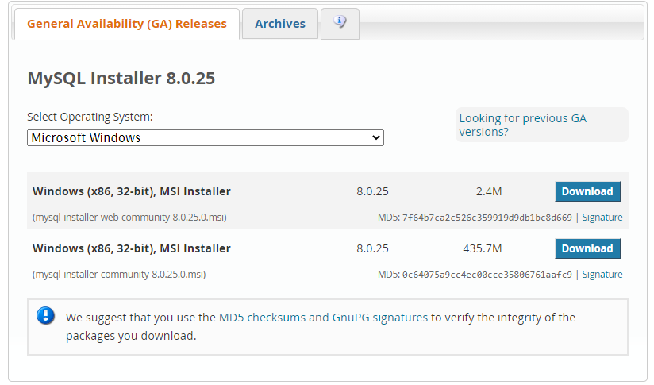

    图1-3-1

2. 选择不登录(No thanks，just start my download.)下载

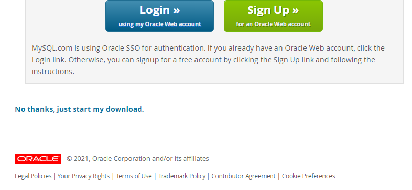

    图1-3-2

3. 下载完成后运行程序，选择Server only(只安装mysql),然后一直下一步

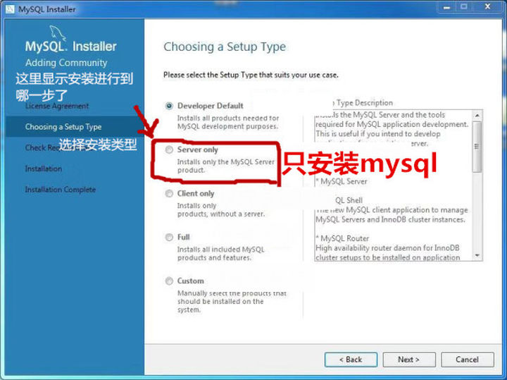

    图1-3-3

4.  选择Standalone MySQL Server / Classic MySQL Replication，然后保持默认选项一直下一步

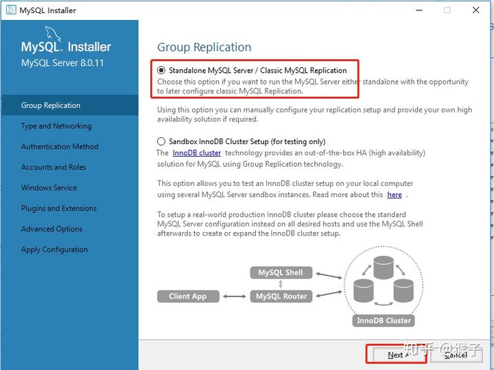
    
    图1-3-4

5. (重要)选择密码验证方式，这里一定要选第二个，mysql 8.x换了加密插件，如果选择第一种方式，很可能导致navicat等客户端连不上mysql

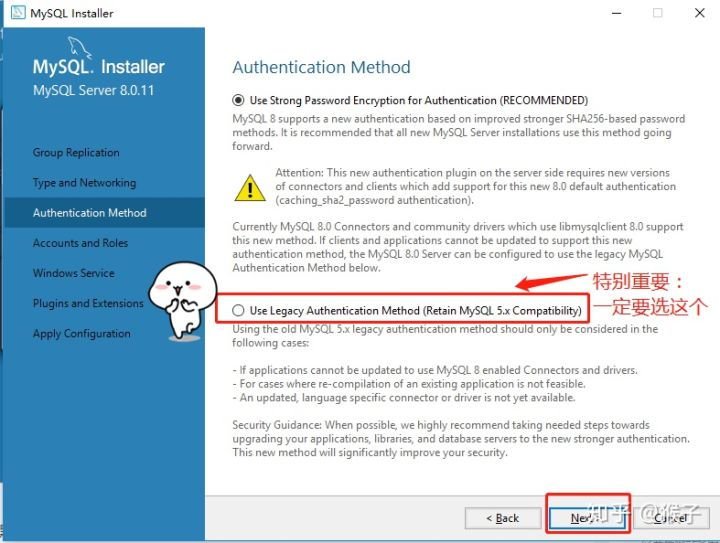

    图1-3-5

6. 这一步只需要设置密码，需要牢记，建议将登陆用户名（一般默认是root）和密码（下图的地方设置）做好记录，后面需要用这个密码连接数据库。点击下一步
  
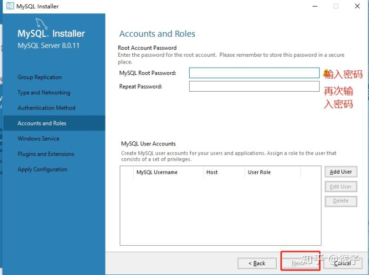

    图1-3-6

7. 保持默认选项，这一步中的Windows Service Name 我们设置为MySQL80，记住这里设置的名字，后续可能会用到(如果出现警告标识说明名称重复，换个其他名字)

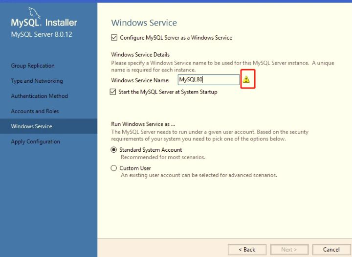

    图1-3-7

8. 按图示勾选，点击确认，一直下一步

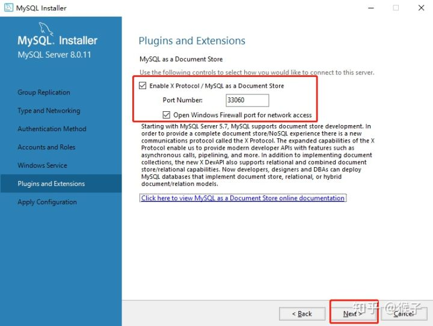

    图1-3-8

9. 输入用户名(root)和密码(你设置的密码)，点击check，检查是否正确。然后一直点击下一步直到安装完成
    
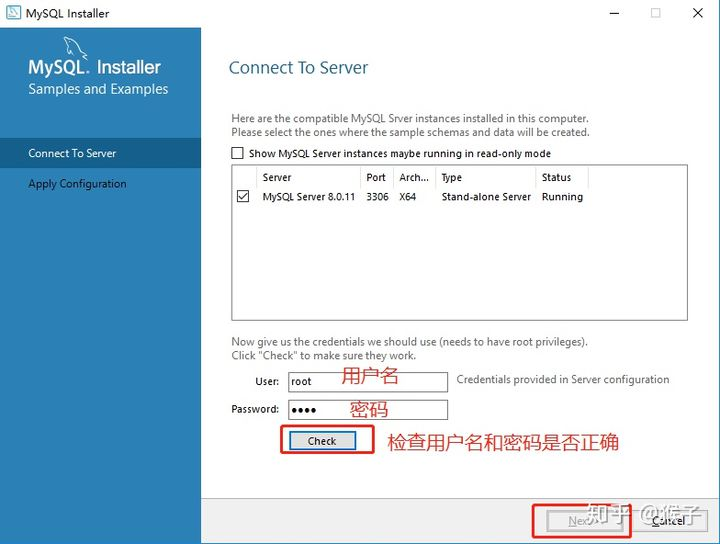

    图1-3-9

验证安装情况
~~~~~~~~~~~~~~~~~~~~~~

1. 在开始菜单或者在搜索框中输入mysql，点击MySQL 8.0 Command Line Client按下图操作从开始菜单中打开刚刚安装的mysql命令行客户端

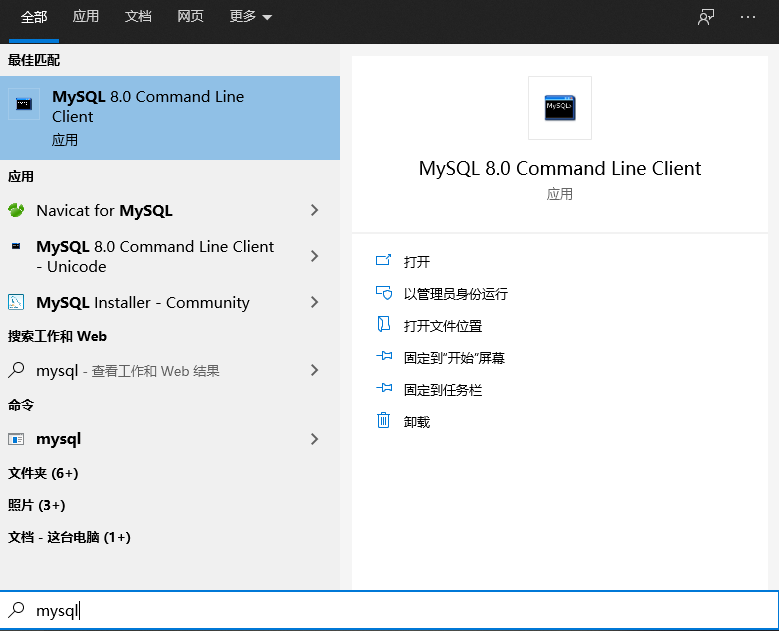

    图1-3-10

2. 输入密码，可以看到如下内容，即表示安装成功

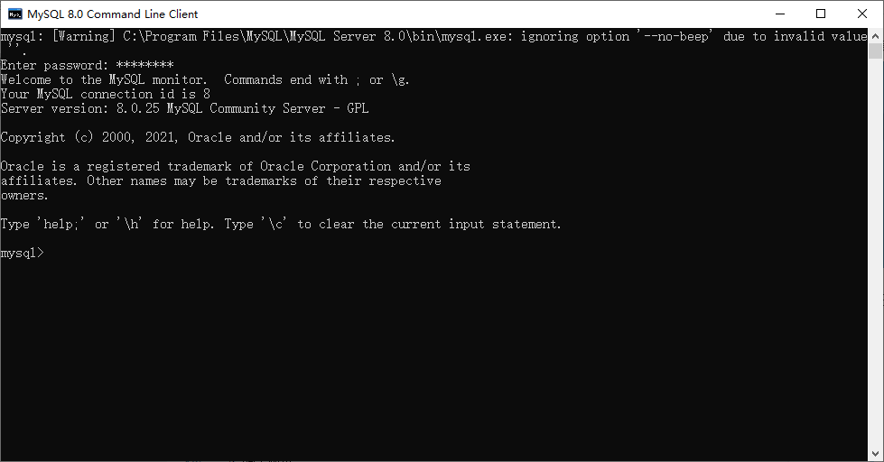

    图1-3-11

常见问题
~~~~~~~~~~~~~~~~~~~~~~

1. 下载完成后通过navicat for mysql连接数据库时候可能会出现报错 1251- Client does not support......，可在任务管理器-> 服务 中把MySql服务停止，启动MySQL80(在下载和安装的第7步中设置的名称)服务
 

