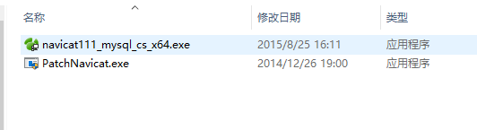
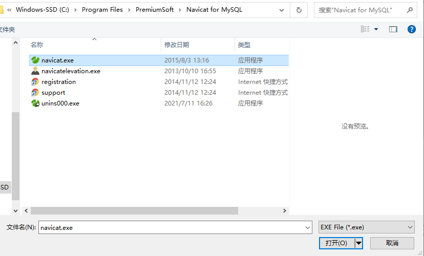
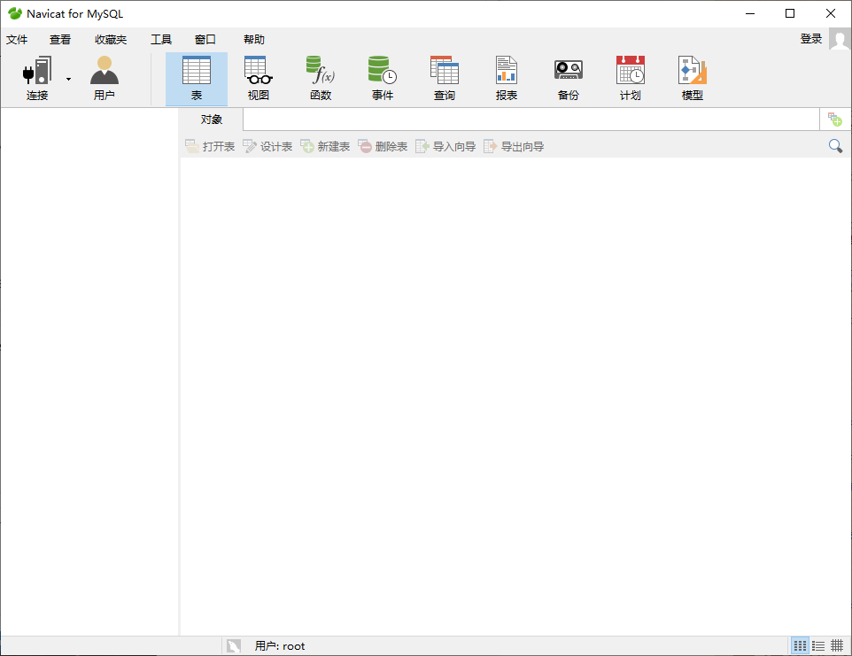

Navicat for Mysql软件的下载
============================================

Navicat for MySQL是什么
~~~~~~~~~~~~~~~~~~~~~~~~~~~~~~~~~~~~~~~~~~~~

Navicat for MySQL 是管理和开发 MySQL 或 MariaDB 的理想解决方案。它是一套单一的应用程序，能同时连接 MySQL 和 MariaDB 数据库，并与 Amazon RDS、Amazon Aurora、Oracle Cloud、Microsoft Azure、阿里云、腾讯云和华为云等云数据库兼容。这套全面的前端工具为数据库管理、开发和维护提供了一款直观而强大的图形界面。

下载和安装
~~~~~~~~~~~~~~~~~~~~

1. 通过网盘链接下载

https://pan.baidu.com/s/19BlJRx7tLnDPIM4U6DNWvA 提取码: d9ci

2. 下载后解压文件，有两个.exe文件，首先点navicat111_mysql_cs_x64.exe, 安装默认选项进行安装.

    图1-2-1

3. 安装完成之后点PatchNavicat.exe, 选择安装到Navicat for MySQL目录下的navicat.exe，默认安装目录在C:\Program Files\PremiumSoft\Navicat for MySQL

    
    图1-2-2

出现 下图说明安装成功

    图1-2-3

4. 启动Navicat for MySQL，会看到如下界面

    图1-2-4

后续我们会慢慢熟悉软件的使用