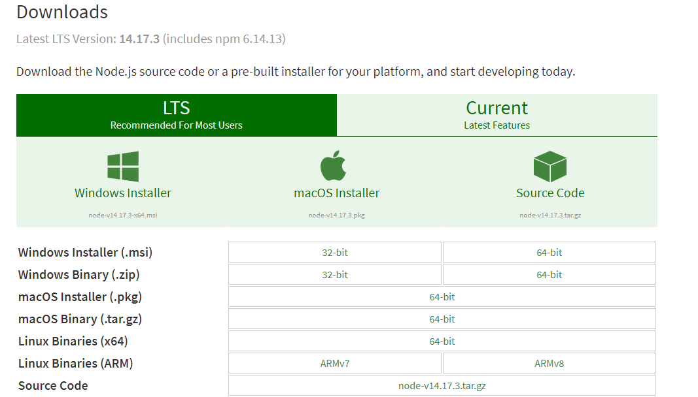

Node.js的环境搭建
=============================

Node.js
~~~~~~~~~~~~~~~~

Node（正式名称 Node.js）是一个开源的、跨平台的运行时环境，有了它，开发人员可以使用 JavaScript 创建各种服务器端工具和应用程序。此运行时主要用于浏览器上下文之外（即可以直接运行于计算机或服务器操作系统上）。据此，该环境省略了一些浏览器专用的 JavaScript API，同时添加了对更传统的 OS API（比如 HTTP 库和文件系统库）的支持。

简单的说 Node.js 就是运行在服务端的 JavaScript。如果你是一个前端程序员，你不懂得像PHP、Python或Ruby等动态编程语言，然后你想创建自己的服务，那么Node.js是一个非常好的选择。

下载安装
~~~~~~~~~~~~~~~~~~

1. 进入官方下载页面 https://nodejs.org/en/download/ , 以下载 Windows Installer (.msi) 64-bit 为例

   图1-4-1

2. 下载完成后打开安装程序，保持默认选择，一直点击下一步(默认安装目录在 C:\\Program Files\\nodejs  )

.. figure:: media/download_Nodejs/1-4-2.png
   :alt: error
   :align: center 

   图1-4-2

.. figure:: media/download_Nodejs/1-4-3.png
   :alt: error
   :align: center

   图1-4-3

验证安装
~~~~~~~~~~~~~~~~~~~~~

1. win10系统下，开始菜单 -> 设置 -> 系统 -> 关于 -> 相关设置 -> 高级系统设置 -> 环境变量 -> 双击path查看

   图1-4-4

看到环境变量中已经包含了 C:\\Program Files\\nodejs\\ (安装时选择的路径) 则说名环境变量已经配置

2. 在搜索栏中输入cmd，打开命令提示符，输入node --version可检测node.js版本

   图1-4-5

