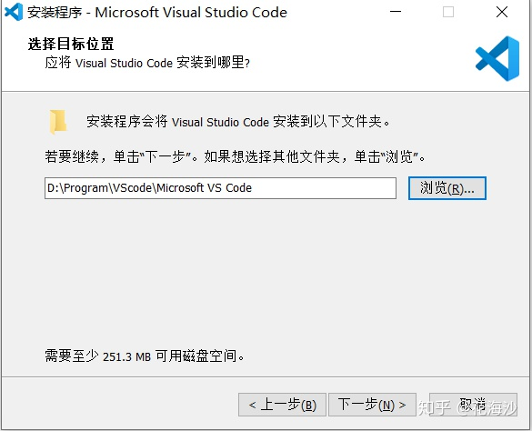

vscode的下载
============================================

vscode是什么
~~~~~~~~~~~~~~~~~~~~

vscode是一款由微软开发，同时支持windows、linux和macos操作系统的开放代码编辑器。vscode编辑器集成了所有一款现代编辑器所应该具备的特性，包括语法高亮、可定制的热键绑定、括号匹配、以及代码片段收集等。

下载和安装
~~~~~~~~~~~~~~~~~~~~

1. 进入vsc官网 https://code.visualstudio.com/

    图1-1-1

2. 点击右上角Download, 以Windows10 64位系统为例，选择System Installer 64bit版本下载(可根据自己系统选择)。
   
User Installer版：会安装在当前计算机帐户目录,意味着如果使用另一个帐号登陆计算机将无法使用别人安装的vscode。System Installer版：安装在非用户目录,例如C盘根目录,任何帐户都可以使用。vscode默认提供的User Installer版,大多数人都是用的这个版本。

    图1-1-2

3. 下载完成后，双击打开安装程序，保持默认选项，点击下一步

    图1-1-3

    图1-1-4

4. 勾选选项，点击下一步，然后安装，等待安装结束

    图1-1-5

5. 配置插件

以中文(简体)插件为例，打开VScode, 点击左侧方块，在搜索框中输入Chinese，选择插件，点击install即可安装

如果要卸载插件，直接在已安装位置点击uninstall即可

一些常见插件：Chinese,Visual Studio IntelliCode,Simple React Snippets,Prettier - Code formatter,Git Graph.

常见问题
~~~~~~~~~~~~~~~~~~~~~~~~

1. 国内下载慢，科学上网、国内镜像
[Visual Studio Code (VSCode) 常见问题：国内无法下载/下载慢](https://blog.csdn.net/moxiaoxuanyu/article/details/113185863)

2. 不弹出下载窗口

部分人使用chrome进入下载页面不能自动开始下载，点击手动链接也没反应，可在任务管理器-> 服务 中的最下端把迅雷基础服务停止，然后重启浏览器即可。或者可以直接使用Edge浏览器进入下载页面下载