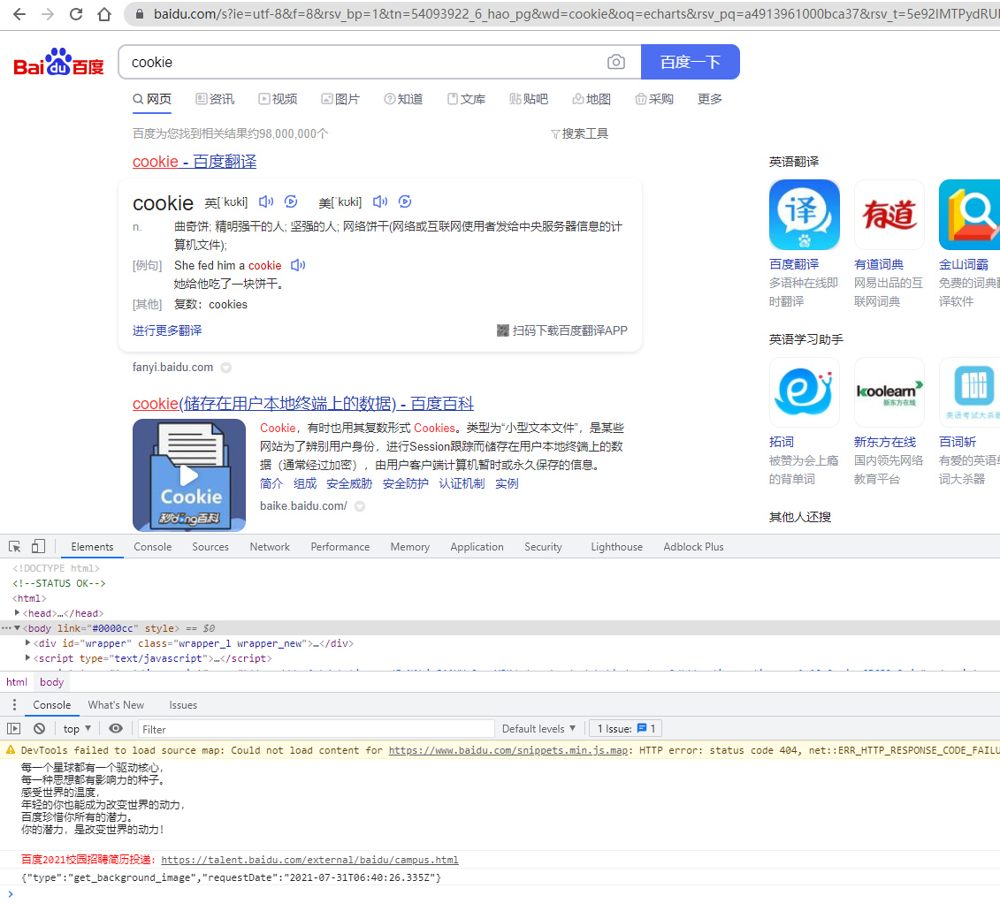
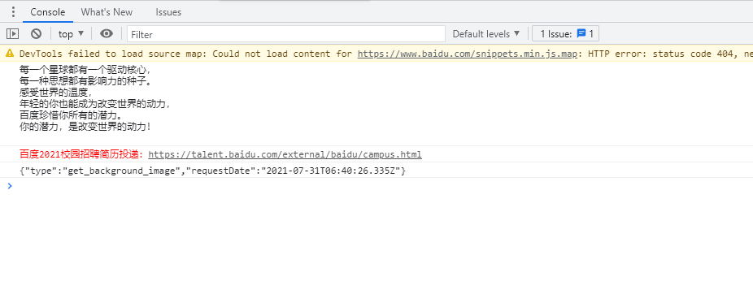
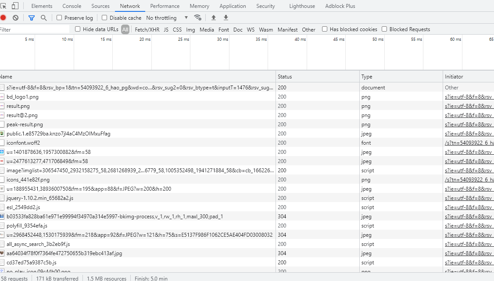
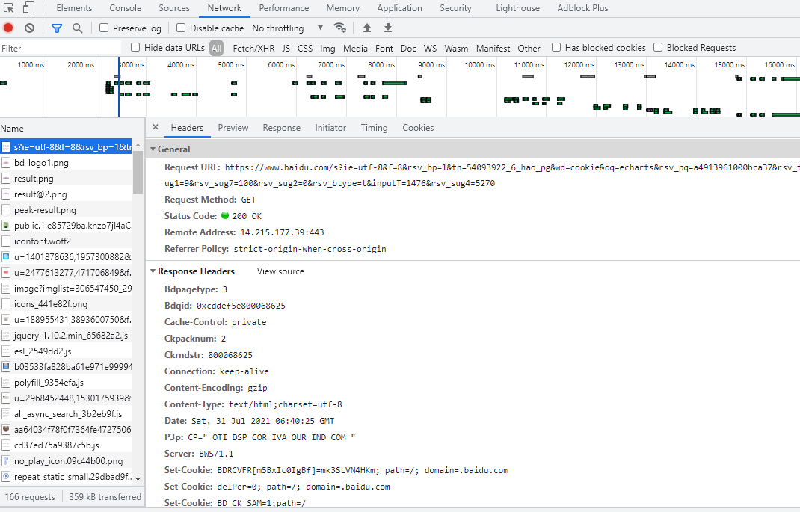
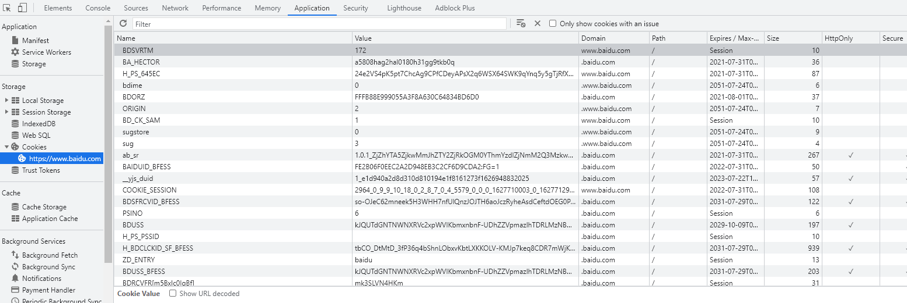

Web浏览器
==================================

web浏览器有哪些
~~~~~~~~~~~~~~~~~~~~~~~~~~~~~~~~~~~~

- Internet Explorer（IE浏览器）

- Microsoft Edge 浏览器

- Google Chrome（谷歌浏览器）

- Firefox（火狐浏览器）

- Apple Safari（苹果 Safari 浏览器）

- Opera 浏览器

- Netscape 浏览器

- \......

其中比较流行的有

- **Firefox**

- **Chrome**

- **InternetExplorer**

文中的大部分程序也会基于这三个浏览器来进行调试

开发者模式
~~~~~~~~~~~~~~~~~~~~~~~~~~~~~~

接下来我们简单尝试一下如何使用浏览器来打开开发者模式进行程序调试

以Chrome浏览器为例:

1. 打开任意一个页面，如百度搜索Cookie，然后按下F12，可以看到控制台在下方显示(浏览器的设置不同，也可能在右侧显示）

    图developer

2. 通过  Element，可以看到当前页面的html代码。下方console界面显示控制台打印的信息，是调试程序的最常用工具

    图console

3. network中记录了网页的请求信息

    图network

鼠标点击任一条目，可以看到请求地址、请求头、请求类型、服务器状态码、响应头等信息

    图network2

4. 在application中主要是记录网站加载的所有资源信息，包括存储数据、缓存数据、字体、图片、脚本、样式表等。如点击cookie可以查看一些本地用户信息

    图cookie

不同浏览启用开发者模式的方法基本相同，功能和组件上可能存在一些差异

兼容问题
~~~~~~~~~~~~~~~~~~~~~~~~~~~~~~~

市场上浏览器种类很多，不同浏览器采用的内核不尽相同。浏览器内核主要分为两种，一是渲染引擎，另一个是JS引擎，这边所说的内核更倾向于渲染引擎。

所谓兼性问题，就是指因为不同的浏览器因为内核不同，从而对同一段代码有着不同的解析，造成页面显示效果不统一的情况。

常见的如：

- IE浏览器：Trident
- Chrome浏览器：Webkit(<28)，Blink(>=28)
- Firefox浏览器：Gecko

不同产品之间有着不同的标准，不同的实现方式，甚至于同一产品的不同版本之间也有兼容性问题，版本越老， bug 越多，版本越新，功能越多。

前段开发要考虑什么
~~~~~~~~~~~~~~~~~~~~~~~~~~~~~~~~~~~~~~~

许多前段工程师在开发调试程序时会有自己偏好的浏览器，但是产品是面向用户的，即便是饱受诟病的ie浏览器仍然占据大量的市场份额，
这就使得Web前段人员在开发时不得不考虑自己的程序在不同浏览器上的兼容问题，以求达到无论用户使用什么浏览器来查看我们的网站或者登录我们的系统，都应该是统一的现实效果。

常见兼容性问题及解决方法
~~~~~~~~~~~~~~~~~~~~~~~~~~~~~~~~~~~~~~~~

常见的浏览器兼容问题大致分为一下三类：

- HTML兼容
- CSS兼容
- JavaScript兼容

解决方法:

