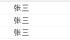

作用域与this的使用
~~~~~~~~~~~~~~~~~~~~~~~~~~~~~~~~~~~~~~~~~~~

全局作用域与函数作用域
-------------------------------------------

全局作用域
^^^^^^^^^^^^^^
全局作用域在页面打开时创建，在页面关闭时销毁。

1. 直接编写在script标签中的JS代码都在全局作用域中。
2. 全局作用域有一个全局对象为window，它由浏览器创建可以直接使用。
    
   - 在全局作用域中创建的变量都会作为window对象的属性保存
   - 在全局作用域中创建的函数都会作为window对象的方法保存

函数作用域
^^^^^^^^^^^^^^
调用函数时会创建函数作用域，函数执行完毕以后作用域就会销毁。

1. 每调用一次函数就会创建一个新的函数作用域，它们之间是相互独立的
2. 函数作用域可以访问到全局作用域的变量，在全局作用域中无法访问到函数作用域的变量
3. 在函数作用域中操作一个变量时会先从自身作用域中寻找，如果有该变量即直接使用，若没有则逐级向上一作用域寻找直至全局作用域。
4. 在函数中要访问全局变量可以使用window对象。

示例：

.. code-block:: sh
   :linenos:

    <!DOCTYPE html>
    <html lang="en">
    <head>
    <meta charset="UTF-8">
    <title>Document</title>
    
    </head>
    <body>
        
    </body>
    </html>

显示结果如下：

this的使用
-------------------------------------------

.. code-block:: sh
   :linenos:

    <!DOCTYPE html>
    <html lang="en">
    <head>
    <meta charset="UTF-8">
    <title>Document</title>
    
    </head>
    <body>
        
    </body>
    </html>

显示结果如下：

从本示例可以看出控制台输出的三次内容都来自第7行代码。这里就需要引入this的用法了。

解析器在调用函数每次都会向函数内部传递进一个隐含参数，这个隐含参数就是this，this指向一个对象，这个对象我们称为函数执行的上下文对象。

根据函数的调用方式不同，this会指向不同的对象：
    
- 以函数的形式调用时，this永远都是window
- 以方法的形式调用时，this就是调用方法的对象 
- 当以构造函数的形式调用时，this就是新创建的那个对象
  
修改如下：

.. code-block:: sh
   :linenos:

    function show() {
        console.log(this.name);
    }
   

显示结果如下：

