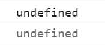

数据类型与强制类型转换
~~~~~~~~~~~~~~~~~~~~~~~~~~~~~~~~~~~~~~~~~~~~~~~~~~~~~~~~~~~~~
数据类型指的是字面量的类型，在JavaScript中一共有六种数据类型。

- 字符串 String
- 数值 Number
- 布尔值 Boolean
- 空值 Null
- 未定义 Undefined
- 对象 Object

其中前五种属于基本数据类型，而Object属于引用数据类型。

在比较基本数据类型时，比较的是值；在比较引用数据类型时，比较的是对象的地址。

字符串 String
-------------------------------------------------------------
 
- 在JS中字符串需要双引号或单引号引起来，但是不能混合使用。
- 引号不能嵌套，双引号里不能放双引号，单引号里不能放单引号。

.. code-block:: sh
   :linenos:

   <!DOCTYPE html>
    <html lang="en">
    <head>
        <meta charset="UTF-8">
        <title>Document</title>
        
    </head>
    <body>
    
    </body>
    </html>

数值 Number
-------------------------------------------------------------
在JS中所有数值都是Number，包括整数和浮点数。

- JS中可以表示的数字的最大值：Number.MAX_VALUE。大于最大值则返回Infinity(字面量，数据类型属于number)。
- JS中可以表示的数字的最大值：Number.MIN_VALUE。小于最小值则返回-Infinity。
- JS中NaN表示Not A Number，它也属于number类型。对NaN的详细讲解在后面可见。

.. code-block:: sh
   :linenos:

    <!DOCTYPE html>
    <html lang="en">
    <head>
        <meta charset="UTF-8">
        <title>Document</title>
        
    </head>
    <body>

    </body>
    </html>

显示结果如下：

布尔值 Boolean
-------------------------------------------------------------
布尔值只有两个，主要用来做逻辑判断。

- true 真
- false 假
  
.. code-block:: sh
   :linenos:

    <!DOCTYPE html>
    <html lang="en">
    <head>
        <meta charset="UTF-8">
        <title>Document</title>
        
    </head>
    <body>

    </body>
    </html>

显示结果如下：

    

空值 Null
-------------------------------------------------------------
Null类型的值只有一个，就是null。null这个值专门用来表示一个为空的对象。

.. code-block:: sh
   :linenos:

    <!DOCTYPE html>
    <html lang="en">
    <head>
        <meta charset="UTF-8">
        <title>Document</title>
        
    </head>
    <body>

    </body>
    </html>

显示结果如下：

    

未定义 Undefined
-------------------------------------------------------------
Undefined类型的值只有一个，为undefined。当声明一个变量但是并不给变量赋值时它的值就是undefined。

.. code-block:: sh
   :linenos:

    <!DOCTYPE html>
    <html lang="en">
    <head>
        <meta charset="UTF-8">
        <title>Document</title>
        
    </head>
    <body>

    </body>
    </html>

显示结果如下：

对象 Object
-------------------------------------------------------------
是一种引用数据类型，详情请看第九章。

强制类型转换
-------------------------------------------------------------
转换成String、Number、Boolean

转换成String
^^^^^^^^^^^^^^^^^^
1.调用被转化数据类型的toString()方法。

.. code-block:: sh
   :linenos:

    <!DOCTYPE html>
    <html lang="en">
    <head>
        <meta charset="UTF-8">
        <title>Document</title>
        
    </head>
    <body>

    </body>
    </html>

显示结果如下：

该方法不会影响原变量，它会将转换的结果返回，但需要注意的是null和undefined两个值没有toString()。

2.调用String函数，并将被转化的数据作为参数传递给函数

.. code-block:: sh
   :linenos:

    <!DOCTYPE html>
    <html lang="en">
    <head>
        <meta charset="UTF-8">
        <title>Document</title>
        
    </head>
    <body>

    </body>
    </html>

显示结果如下：

该方法对于Number和Boolean来说在底层就是调用toString()，但是对null和undefined来说是直接将null undefine转换成将"null" "undefined"

转换成Number
^^^^^^^^^^^^^^^^^^
1.使用Number()函数。

- 字符串
    - 如果是纯数字的字符串，则直接将其转化为数字。
    - 如果字符串中有非数字的内容，则转换为NaN。
    - 如果字符串是一个空串或者是一个全是空格的字符,则转换为0.
- 布尔值
    - true 转化成数字1。
    - false 转化成数字0。
- null 转化成数字 **0** 
- undefined 转化成数字 **NaN**

2.针对字符串类型可以使用如下函数：

- parseInt()把一个字符串转换为一个整数。
- parseFloat()把一个字符串转换为一个浮点数。

.. code-block:: sh
   :linenos:

    <!DOCTYPE html>
    <html lang="en">
    <head>
        <meta charset="UTF-8">
        <title>Document</title>
        
    </head>
    <body>

    </body>
    </html>

显示结果如下：

parseFloat()与parseInt()作用类似，不同的是它可以获得有效的小数。

.. code-block:: sh
   :linenos:

    <!DOCTYPE html>
    <html lang="en">
    <head>
        <meta charset="UTF-8">
        <title>Document</title>
        
    </head>
    <body>

    </body>
    </html>

显示结果如下：

如果对非String使用parseInt()或parseFloat()，它会先将其转换为String然后再操作。因此：

.. code-block:: sh
   :linenos:

    <!DOCTYPE html>
    <html lang="en">
    <head>
        <meta charset="UTF-8">
        <title>Document</title>
        
    </head>
    <body>

    </body>
    </html>

显示结果如下：

转换成Boolean
^^^^^^^^^^^^^^^^^^
使用Boolean()函数。

- Number转布尔值：除了0和NaN为false，其余都是true。
- String转布尔值：除了空串为false，其余都是true。
- Null转布尔值：false
- Undefined转布尔值：false。
- Object转布尔值：true。
