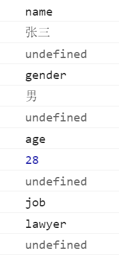

条件与循环语句
~~~~~~~~~~~~~~~~~~~~~~~~~~~~~~~~~~~
if语句(条件判断语句)
-----------------------------------
    
.. code-block:: sh
   :linenos:

    <!DOCTYPE html>
    <html lang="en">
    <head>
        <meta charset="UTF-8">
        <title>Document</title>
         
    </head> 
    <body>

    </body>
    </html>

switch语句(条件分支语句)
-----------------------------------

.. code-block:: sh
   :linenos:

    <!DOCTYPE html>
    <html lang="en">
    <head>
        <meta charset="UTF-8">
        <title>Document</title>
         
    </head> 
    <body>

    </body>
    </html>

while语句与do...while语句
-----------------------------------
两个语句功能相似，while语句先判断后执行，do...while语句先执行后判断。

while语句:

.. code-block:: sh
   :linenos:

    <!DOCTYPE html>
    <html lang="en">
    <head>
        <meta charset="UTF-8">
        <title>Document</title>
         
    </head> 
    <body>

    </body>
    </html>

do...while语句：

.. code-block:: sh
    :linenos:
 
     <!DOCTYPE html>
     <html lang="en">
     <head>
         <meta charset="UTF-8">
         <title>Document</title>
          
     </head> 
     <body>
 
     </body>
     </html>

for循环与for...in循坏
-----------------------------------
for语句遍历代码块：

1. 执行初始化表达式
2. 执行条件表达式判断是否执行循环
3. 执行更新表达式，再重复到步骤2

.. code-block:: sh
    :linenos:

    for(初始化表达式;条件表达式;更新表达式) {
        语句;
    }
 
示例：

.. code-block:: sh
    :linenos:
 
     <!DOCTYPE html>
     <html lang="en">
     <head>
         <meta charset="UTF-8">
         <title>Document</title>
          
     </head> 
     <body>
 
     </body>
     </html>

for...in语句遍历对象属性 : 当对象中的属性不明确时可以使用。

.. code-block:: sh
   :linenos:

    <!DOCTYPE html>
    <html lang="en">
    <head>
        <meta charset="UTF-8">
        <title>Document</title>
        
    </head>
    <body>

    </body>
    </html>

显示结果如下：

break与continue
-----------------------------------
break关键字可以跳出循环，continue关键字可以结束本次循环。
