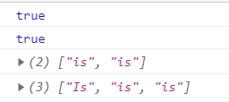
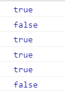
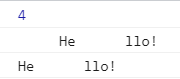

正则表达式与JSON
~~~~~~~~~~~~~~~~~~~~~~~~~~~~~~~~~~~

正则表达式
-----------------------------------
正则表达式是构成搜索模式的字符序列。该搜索模式可用于文本搜索和文本替换操作。

正则表达式的创建
^^^^^^^^^^^^^^^^^^^^^^^^^^^^^^^^^^^

.. code-block:: html
  :linenos:

    var reg1(变量名) = new RegExp(pattern, attributes);
    var reg2 = /pattern/attributes;

- pattern : 正则表达式
- attributes ： 匹配模式

正则表达式方法
^^^^^^^^^^^^^^^^^^^^^^^^^^^^^^^^^^^

=============== =================================================
compile             编译正则表达式
exec                检索字符串中指定的值。返回找到的值，并确定其位置
test                检索字符串中指定的值。返回 true 或 false
=============== =================================================

支持正则表达式的 String 对象的方法
^^^^^^^^^^^^^^^^^^^^^^^^^^^^^^^^^^^

=============== =================================================
search              检索与正则表达式相匹配的值
match               找到一个或多个正则表达式的匹配
replace             替换与正则表达式匹配的子串
split               把字符串分割为字符串数组
=============== =================================================

修饰符
^^^^^^^^^^^^^^^^^^^^^^^^^^^^^^^^^^^
对应参数attribute

====== ======================================================
i       执行对大小写不敏感的匹配。
g       执行全局匹配（查找所有匹配而非在找到第一个匹配后停止）
m       执行多行匹配
====== ======================================================

示例1：

.. code-block:: html
  :linenos:

    <!DOCTYPE html>
    <html lang="en">
    <head>
        <meta charset="UTF-8">
        <title>Document</title>
        
    </head>
    <body>
        
    </body>
    </html>

显示结果如下：

方括号
^^^^^^^^^^^^^^^^^^^^^^^^^^^^^^^^^^^

=============== ============================================
\|                  或
[abc]               查找方括号之间的任何字符
[^abc]              查找任何不在方括号之间的字符
[0-9]               查找任何从 0 至 9 的数字
[a-z]               查找任何从小写 a 到小写 z 的字符
[A-Z]               查找任何从大写 A 到大写 Z 的字符
[A-z]	            查找任何从大写 A 到小写 z 的字符
(red|green)         查找任何指定的选项
=============== ============================================

示例2：

.. code-block:: html
  :linenos:

    <!DOCTYPE html>
    <html lang="en">
    <head>
        <meta charset="UTF-8">
        <title>Document</title>
        
    </head>
    <body>
        
    </body>
    </html>

显示结果如下：

元字符
^^^^^^^^^^^^^^^^^^^^^^^^^^^^^^^^^^^

======== ======================================================
\\w         查找单词字符
\\W         查找非单词字符
\\d         查找数字字符
\\D         查找非数字字符
\\s         查找空白字符
\\S         查找非空白字符
\.          查找单个字符，除了换行和行结束符
\\b         匹配单词边界
\\B         匹配非单词边界
\\r         查找回车符
\\t         查找制表符
\\         转义字符( \\.表示\.，\\\\表示\\ )
======== ======================================================

量词
^^^^^^^^^^^^^^^^^^^^^^^^^^^^^^^^^^^

======== ======================================================
n+         匹配任何包含至少一个 n 的字符串(+ 相当于{1,})
n*         匹配任何包含零个或多个 n 的字符串(* 相当于{0,})
n?         匹配任何包含零个或一个 n 的字符串(? 相当于{0,1})
n{X}       匹配包含 X 个 n 的序列的字符串
n{X,Y}     匹配包含 X 至 Y 个 n 的序列的字符串
n{X,}      匹配包含至少 X 个 n 的序列的字符串
n$         匹配任何结尾为 n 的字符串
^n         匹配任何开头为 n 的字符串
======== ======================================================

示例3：

.. code-block:: html
  :linenos:

    <!DOCTYPE html>
    <html lang="en">
    <head>
        <meta charset="UTF-8">
        <title>Document</title>
        
    </head>
    <body>
        
    </body>
    </html>

显示结果如下：

JSON
-----------------------------------