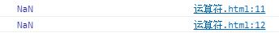
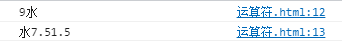
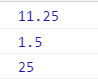
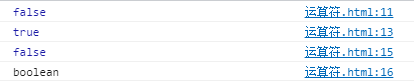
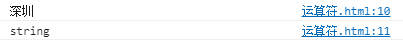
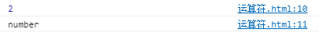
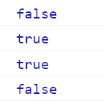
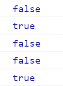

运算符
===================================
算数运算符
-----------------------------------
常用的算术运算符包括：

- 加法 +
- 减法 -
- 乘法 *
- 除法 /
- 取模(余数) %
- 递加 ++
- 递减 --
- 取幂 **

算术运算符的使用很简单，在对于非Number类型的值进行运算时，会将这些值先转换为Number然后再运算，结果的数据类型也是number。
需要注意的是：

1.任何值和NaN做运算结果都得NaN。

.. code-block:: sh
   :linenos:

    <!DOCTYPE html>
    <html lang="en">
    <head>
        <meta charset="UTF-8">
        <title>Document</title>
        
    </head>
    <body>

    </body>
    </html>

显示结果如下：

2.任何值与字符串(包括空串)进行 **加法运算** 都会被转换成字符串，并进行拼串。

.. code-block:: sh
   :linenos:

    <!DOCTYPE html>
    <html lang="en">
    <head>
        <meta charset="UTF-8">
        <title>Document</title>
        
    </head>
    <body>

    </body>
    </html>

显示结果如下：

3.下面是一些简单的例子：

.. code-block:: sh
   :linenos:

    <!DOCTYPE html>
    <html lang="en">
    <head>
        <meta charset="UTF-8">
        <title>Document</title>
        
    </head>
    <body>

    </body>
    </html>

显示结果如下：

逻辑运算符
-----------------------------------
JS中有三种逻辑运算符：

1. 非 !

- 当该值是布尔值时，非运算就是对其取反
- 当该值不是布尔值时，则先将其先转换为布尔值再取反
- 返回结果为布尔值

.. code-block:: sh
   :linenos:

    <!DOCTYPE html>
    <html lang="en">
    <head>
        <meta charset="UTF-8">
        <title>Document</title>
        
    </head> 
    <body>

    </body>
    </html>  

显示结果如下：

2. 与 &&
 
- 两个值中只要有一个false就会返回false
- 对于非布尔值，系统会自动将其转化为布尔值，然后再运算，并且返回原数值类型。
- 如果第一个值为false，则直接跳过第二个值的检验。

返回结果规律：
    若前一个值为false则返回第一个值，反之则返回第二个值。

.. code-block:: sh
   :linenos:

    <!DOCTYPE html>
    <html lang="en">
    <head>
        <meta charset="UTF-8">
        <title>Document</title>
        
    </head> 
    <body>

    </body>
    </html>

显示结果如下：

3. 或 ||
  
- 两个值中只要有一个true就会返回true
- 对于非布尔值，系统会自动将其转化为布尔值，然后再运算，并且返回原数值类型。
- 如果第一个值为true，则直接跳过第二个值的检验。

返回结果规律：
    若前一个值为true则返回第一个值，反之则返回第二个值。

.. code-block:: sh
   :linenos:

    <!DOCTYPE html>
    <html lang="en">
    <head>
        <meta charset="UTF-8">
        <title>Document</title>
         
    </head> 
    <body>

    </body>
    </html>

显示结果如下：

关系运算符
-----------------------------------
比较两个值之间的大小关系，若关系成立则返回true，若关系不成立则返回false。
对于非数值进行比较，会将其转换为数字再比较。但是当符号两端都是字符串时，则将两端的字符串一位一位的按Unicode编码比较。

.. code-block:: sh
   :linenos:

    <!DOCTYPE html>
    <html lang="en">
    <head>
        <meta charset="UTF-8">
        <title>Document</title>
        
    </head> 
    <body>

    </body>
    </html>

显示结果如下：

相等运算符与赋值运算符
-----------------------------------

相等运算符
^^^^^^^^^^^^^^^^^^
- 相等运算符用于判断两个值是否相等，相等则返回true，不相等返回false。
- 不等运算符相等运算符用于判断两个值是否不相等，不相等则返回true，相等返回false。
- 当用 **==** 或 **!=** 来比较两个值时，如果值的类型不同，则会自动转换成相同的类型。一般都转换成Number。
- 运算符 **===** 严格相等(运算符 **！==** 严格不相等)，在比较两个值时不会进行类型转换。所以当两个值类型不同时，直接返回false(true).

.. code-block:: sh
   :linenos:

    <!DOCTYPE html>
    <html lang="en">
    <head>
        <meta charset="UTF-8">
        <title>Document</title>
        
    </head> 
    <body>

    </body>
    </html>

显示结果如下：

特殊情况：

.. code-block:: sh
    :linenos:
 
     <!DOCTYPE html>
     <html lang="en">
     <head>
         <meta charset="UTF-8">
         <title>Document</title>
         
     </head> 
     <body>
     
     </body>
     </html>

显示结果如下：

赋值运算符
^^^^^^^^^^^^^^^^^^

赋值运算符把右侧的值传递给左侧的变量。

条件运算符
-----------------------------------

又称三元运算符，格式：条件表达式 ? 语句1 : 语句2;

运算符的优先级
-----------------------------------

=====================================  ==========  =========
运算符                                    结合性      优先级
=====================================  ==========  =========
 . 、[] 、()                            从左到右    
new                                     从右到左       vfd
hfiu                                      ref          fd
=====================================  ==========  =========

