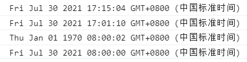

Date与Math
~~~~~~~~~~~~~~~~~~~~~~~~~~~~~~~~~~~

Date
-----------------------------------
在JS中用Date对象表示时间。

创建Date对象
^^^^^^^^^^^^^^^^^^

四种方法：

- new Date()
- new Date(year, month, day, hours, minutes, seconds, milliseconds)
- new Date(milliseconds)
- new Date(date string)

.. code-block:: html
   :linenos:

    <!DOCTYPE html>
    <html lang="en">
    <head>
        <meta charset="UTF-8">
        <title>Document</title>
        
    </head>
    <body>
        
    </body>
    </html>

    
显示结果如下：

Date方法
^^^^^^^^^^^^^^^^^^

================== ===================================
getDate()           以数值返回天（1-31）
getDay()            以数值获取周名（0-6）
getFullYear()       获取四位的年
getHours()          获取小时（0-23）
getMilliseconds()   获取毫秒（0-999）
getMinutes()        获取分（0-59）
getMonth()          获取月（0-11）
getSeconds()        获取秒（0-59）
getTime()           获取时间（从 1970 年 1 月 1 日至今）
================== ===================================

Math
-----------------------------------
在JS中用Math对数字执行数字任务。

================== ===================================
abs(x)                 返回 x 的绝对值
acos(x)                返回 x 的反余弦值，以弧度计
asin(x)                返回 x 的反正弦值，以弧度计
atan(x)                返回 x 的反正切值(-PI/2, PI/2) 
atan2(y,x)             返回从 x 轴到点 (x,y) 的角度
ceil(x)                对 x 进行上舍入
floor(x)               对 x 进行下舍入
log(x)                 返回 x 的自然对数（底为e）
max(x,y,z,...,n)       返回最高值
min(x,y,z,...,n)       返回最低值
pow(x,y)               返回 x 的 y 次幂
random()               返回 0 ~ 1 之间的随机数
sqrt(x)                返回 x 的平方根
sin(x)                 返回 x（x 以角度计）的正弦
tan(x)                 返回角的正切
================== ===================================

示例：随机生成1-10的整数数字

.. code-block:: html
   :linenos:

    <!DOCTYPE html>
    <html lang="en">
    <head>
        <meta charset="UTF-8">
        <title>Document</title>
        
    </head>
    <body>
        
    </body>
    </html>

