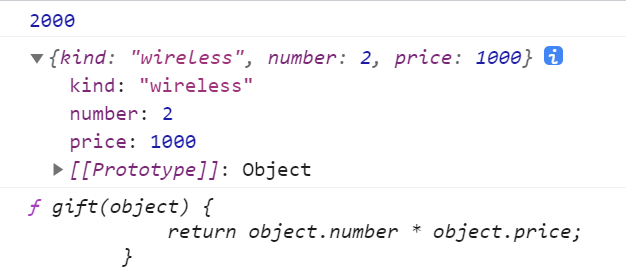

函数
~~~~~~~~~~~~~~~~~~~~~~~~~~~~~~~~~~~

JavaScript函数是被设计为执行特定任务的代码块，会在某代码调用它时被执行。

函数的定义及定义方式
-----------------------------------

函数通过 **function** 关键词进行定义，其后是函数名和括号()。
函数名命名规则与标识符命名规则一致。

定义方式：

.. code-block:: html
   :linenos:

    function name(参数1，参数2) {
        //要执行的代码
        ......
        //返回值
        return ;
    }
 
需要注意的是：

1. 调用函数时解析器不会检查实参的类型
2. 如果实参的数量少于形参的数量，则没有对应实参的形参将是undefined
3. 实参可以是任意数据类型
4. return可以结束整个函数
5. 返回值可以是任意数据类型

函数的调用
-----------------------------------

函数调用情形：

- 局部变量
- 用作变量值的函数
- ()运算符调用的函数

.. code-block:: html
   :linenos:

   <!DOCTYPE html>
    <html lang="en">
    <head>
        <meta charset="UTF-8">
        <title>Document</title>
        
    </head>
    <body>
    
    </body>
    </html>

显示结果如下：

方法
-----------------------------------
如果一个函数作为一个对象的属性保存，那么这个函数就叫做这个对象的方法，调用这个函数即为调用对象的方法。

函数和方法只是名称上的区别，没有本质上的区别。

回调函数
-----------------------------------
由我们创建的函数但是不是由我们调用的函数即为回调函数。

1. 将回调函数的参数作为与回调函数同等级的参数进行传递

.. code-block:: html
   :linenos:

    <!DOCTYPE html>
    <html lang="zh">
    <head>
        <meta charset="UTF-8">
        <title>Document</title>
        
    </head>
    <body>
        
    </body>
    </html>

2. 回调函数的参数在调用回调函数内部创建

.. code-block:: html
   :linenos:

    <!DOCTYPE html>
    <html lang="zh">
    <head>
        <meta charset="UTF-8">
        <title>Document</title>
        
    </head>
    <body>
        
    </body>
    </html>

    
async与ajax函数的使用
-----------------------------------

