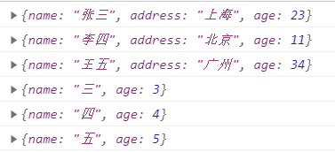
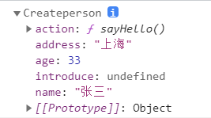

原型对象
~~~~~~~~~~~~~~~~~~~~~~
在说原型对象前需要引入一个概念：构造函数。

构造函数
^^^^^^^^^^^^^^^^^^^^^^^
当我们需要创建对象录入信息时，可以编写如下代码：

.. code-block:: html
   :linenos:

    <!DOCTYPE html>
    <html lang="en">
    <head>
        <meta charset="UTF-8">
        <title>Document</title>
        
    </head>
    <body>
        
    </body>
    </html>

   
显示结果如下：

由结果可知：用这种方法创建的对象都使用了构造函数Object，我们无法区分多种不同种类的对象。这时就需要引入构造函数了。

.. code-block:: html
   :linenos:

    <!DOCTYPE html>
    <html lang="en">
    <head>
        <meta charset="UTF-8">
        <title>Document</title>
        
    </head>
    <body>
       
    </body>
    </html>

   
显示结果如下：

构造函数的执行流程：

1. 立即创建一个新的对象
2. 将新建对象设置为函数中this，在构造函数中可以使用this来引用新建函数
3. 逐行执行函数中代码
4. 将新建对象作为返回值返回
   
使用同一个构造函数创建的对象我们成为一类对象，一个构造函数也就是一个类。我们将通过一个构造函数创建的对象称为是该类的实例。

原型对象的运用
^^^^^^^^^^^^^^^^^^^^^^^

对我们所创建的每一个函数，解析器都会向里面添加一个属性prototype，这个属性对应一个对象，即为原型对象。

- 普通函数调用prototype时没有作用
- 构造函数调用prototype时，它所创建的对象中都会有一个隐含的属性指向该构造函数的原型对象。这个原型对象就相当于一个公共的区域，所有同一个类的实例都可以访问到这个原型对象，故对象共有的内容可以统一设置到原型对象。

当我们使用一个对象的属性或方法时，会先在自身中寻找，如果没有再去指向的原型对象中寻找，如果没有，再去原型对象的原型对象中寻找，直至Object的原型对象，若仍没有则返回undefined。

.. code-block:: html
   :linenos:

    <!DOCTYPE html>
    <html lang="zh">
    <head>
        <meta charset="UTF-8">
        <title>Document</title>
        
    </head> 
    <body>
        
    </body>
    </html>

显示结果如下：

