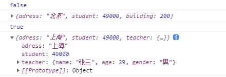

对象
~~~~~~~~~~~~~~~~~~~~~~~~~~~~~~~~~~~

什么是对象
-----------------------------------
定义：
对象属于一种符合的数据类型，在对象中可以保存多个不同数据类型的属性。

1. 内建对象。由ES标准定义，在任何的ES的实现中都可以使用。如String、Number、Function。
2. 宿主对象。由JS运行环境提供的对象，主要是由浏览器提供的对象。如BOM、DOM。
3. 自定义对象。开发人员自己创建的对象。

对象的使用
-----------------------------------

在对象中保存的值就成为了属性。

属性名：尽可能按照标识符的规范命名。
 
属性值：可以是任意的数据类型。

in 运算符：可以检查对象中是否含有指定属性。 

对象的基本操作：

- 创造对象
- 对属性的增删改查：

  - 向对象添加属性 
  - 读取对象中属性    
  - 修改对象的属性值      
  - 删除对象属性      
 
.. code-block:: html
  :linenos:

  <!DOCTYPE html>
  <html lang="en">
  <head>
      <meta charset="UTF-8">
      <title>Document</title>
      
  </head>
  <body>

  </body>
  </html>

显示结果如下：

