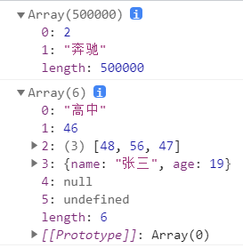
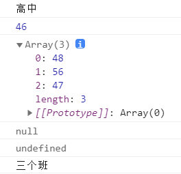
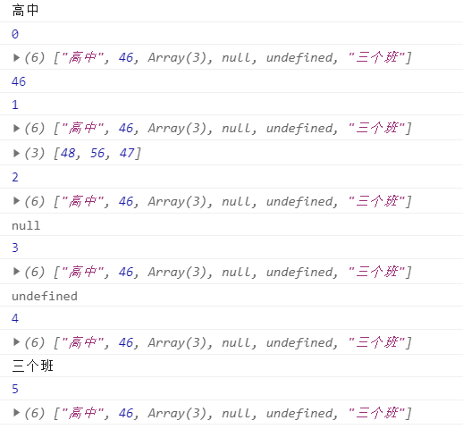
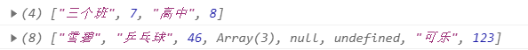
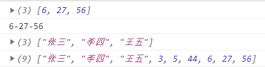
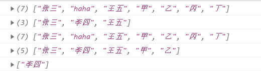
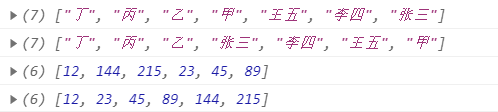

数组
~~~~~~~~~~~~~~~~~~~~~~~~~~~~~~~~~~~

什么是数组
-----------------------------------
数组也是对象，与普通对象功能类似，用来存储一些值，不同的是数组使用数字作为索引操作元素。(从0开始的整数就是索引)

1. 对于连续的数组，可以使用length属性获取数组长度；对于非连续的数组，使用length会获得数组最大的索引+1。
2. 最好创建连续数组，所以要向数组最后一个位置添加元素。 
3. 数组内可以存储任意数据类型

示例：

.. code-block:: html
  :linenos:

    <!DOCTYPE html>
    <html lang="en">
    <head>
        <meta charset="UTF-8">
        <title>Document</title>
        
    </head>
    <body>
        
    </body>
    </html>

  
显示结果如下：

数组的遍历
-----------------------------------
遍历数组就是将数组的所有元素都取出来

1. 使用for循环

.. code-block:: html
  :linenos:

    <!DOCTYPE html>
    <html lang="en">
    <head>
        <meta charset="UTF-8">
        <title>Document</title>
        
    </head>
    <body>
        
    </body>
    </html>

显示结果如下：

2. 使用forEach

.. code-block:: html
  :linenos:

    <!DOCTYPE html>
    <html lang="zh">
    <head>
        <meta charset="UTF-8">
        <title>Document</title>
        
    </head>
    <body>
        
    </body>
    </html>
  

显示结果如下：

数组的方法
-----------------------------------
1. pop() —— 删除数组的最后一个元素，并将被删除的元素作为返回值返回
2. push() —— 向数组末尾添加一个或多个元素，并返回数组新的长度
3. shift() —— 删除数组的第一个元素，并将被删除的元素作为返回值返回
4. unshift() —— 向数组开头添加一个或多个元素并返回新的数组长度，其他元素索引依次调整

示例1：

.. code-block:: html
  :linenos:

    <!DOCTYPE html>
    <html lang="en">
    <head>
        <meta charset="UTF-8">
        <title>Document</title>
        
    </head>
    <body>
        
    </body>
    </html>

显示结果如下：

5. join() —— 把数组的所有元素放入一个字符串，元素通过指定的分隔符进行分割
6. concat() —— 连接两个或更多的数组，并返回结果
    
示例2：

.. code-block:: html
    :linenos:
    
    <!DOCTYPE html>
    <html lang="en">
    <head>
        <meta charset="UTF-8">
        <title>Document</title>
        
    </head>
    <body>
            
    </body>
    </html>

    
显示结果如下：
    

7. splice() —— 删除元素，并向数组添加新元素
8. slice() —— 从某个已有的数组返回选定的元素
    
示例3：

.. code-block:: html
  :linenos:

    <!DOCTYPE html>
    <html lang="en">
    <head>
        <meta charset="UTF-8">
        <title>Document</title>
        
    </head>
    <body>
        
    </body>
    </html>

显示结果如下：

9. reverse() —— 反转数组
10. sort() —— 对数组中元素进行排序

示例4：

.. code-block:: html
  :linenos:
    
    <!DOCTYPE html>
    <html lang="en">
    <head>
        <meta charset="UTF-8">
        <title>Document</title>
        
    </head>
    <body>
            
    </body>
    </html>
    
    
显示结果如下：
    
