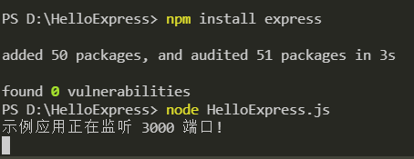
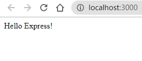

Express
===================================

简介
~~~~~~~~~~~~~~~~

在上一节中，我们已经演示了如何通过npm命令来给工程文件安装express模块，那么express是什么，如何在程序中发挥作用的呢

使用 Express 可以快速地搭建一个完整功能的网站。

Express 框架核心特性：

- 可以设置中间件来响应 HTTP 请求。

- 定义了路由表用于执行不同的 HTTP 请求动作。

- 可以通过向模板传递参数来动态渲染 HTML 页面。

虽然 Express 本身是极简风格的，但是开发人员通过创建各类兼容的中间件包解决了几乎所有的 web 开发问题。这些库可以实现 cookie、会话、用户登录、URL 参数、POST 数据、安全头等功能。可在 Express 中间件 网页中找到由 Express 团队维护的中间件软件包列表（还有一张流行的第三方软件包列表）。

HelloExpress.js
~~~~~~~~~~~~~~~~~~~~~~~~~~~~

1. 新建一个文件夹HelloExpress，文件件内新建文件HelloExpress.js

2. 使用vscode打开文件夹后，在终端中输入

.. code-block:: 
    :linenos:

    npm install express

3. 打开js文件，输入代码：

.. code-block:: js
    :linenos:

    var express = require('express');  //require()引入express模块
    var app = express();        //创建一个express()实例

    //路由定义

    app.get('/', (req, res) => {   //app.get()方法指定了一个回调函数，该函数在每监听到一个关于站点根目录路径('/')的 http GET 请求时调用。此回调函数以一个请求(req)和一个响应对象(res)作为参数
    res.send('Hello Express!');    //调用响应对象的api，send函数
    });

    app.listen(3000, () => {    //在3000端口上启动服务器监听，需要有这一代码块，服务端才能监听到客户端的请求
    console.log('示例应用正在监听 3000 端口!'); //在控制台打印日志
    });

在终端输入命令行 node HelloExpress.js 启动服务器

    图13-2-1

4.服务器运行时，可用浏览器访问 http://localhost:3000，可以看到页面上出现Hello Express!字样。

    图13-2-2

路由
~~~~~~~~~~~~~~~~~~~~~~~~~~~~~~~~~

1. app对象一般用来表示Express程序。通过调用Express模块导出的顶层的express()方法来创建它:

.. code-block:: js
    :linenos:

    var express = require('express');  //require()引入express模块
    var app = express();        //创建一个express()实例

2. app对象具有以下方法

路由HTTP请求；具体可以看app.METHOD和app.param这两个例子。

配置中间件；具体请看app.route。

渲染HTML视图；具体请看app.render。

注册模板引擎；具体请看app.engine。

Express官方文档：https://www.expressjs.com.cn/4x/api.html

3. 几个常见的路由请求的定义

   app.get

   .. code-block:: js
       :linenos:

        app.get('/',(req,res) => {
            //处理请求   
            res.send('这是get请求')
        })

   app.post

   .. code-block:: js
       :linenos:
       
        app.post('/',(req,res) =>{
            //处理请求
            res.send('这是post请求')
        })

   app.delete

   .. code-block:: js
       :linenos:
       
        app.delete('/',(req,res) =>{
            //处理请求
            res.send('这是delete请求')
        })

   app.listen

   .. code-block:: js
       :linenos:
       
        //在3000端口号上启动服务
        app.listen(3000,() =>{})

       
中间件
~~~~~~~~~~~~~~~~~~~~~~~~~~~~~~~

1. 中间件是什么
 
在Express中，中间件就是一个可以访问请求对象、响应对象和调用next方法的一个函数。

在使用时一般使用use方法

.. code-block:: js
    :linenos:
    
    app.use('/', function(req,res,next)=>{
        next();
    });

其中回调函数function就是一个中间件，在中间件处理完数据之后，就会调用next方法

注意：如果当前的中间件功能没有结束请求-响应周期，则必须调调用next()将控制权传递给下一个中间件功能，否则该请求将被挂起

2. 中间件的分类

中间件总共有三种，分别是自定义中间件，内置中间件，第三方中间件