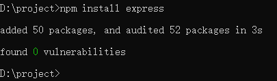
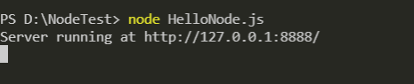
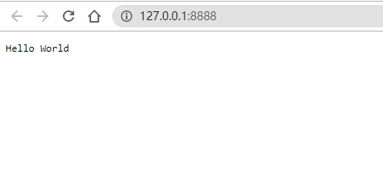
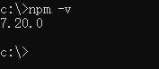
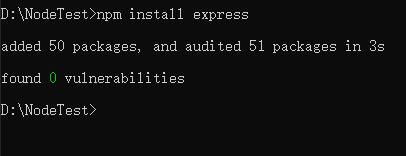

Node.js
=======================

Node.js简介
~~~~~~~~~~~~~~~~~~~~~~~~

Node.js 是一个开源与跨平台的 JavaScript 运行时环境。 它是一个可用于几乎任何项目的流行工具！Node.js 在浏览器外运行 V8 JavaScript 引擎(Google Chrome 的js内核)。这使 Node.js 表现得非常出色。

如果你是一个前端程序员，你不懂得像PHP、Python或Ruby等动态编程语言，然后你想创建自己的服务，那么Node.js是一个非常好的选择。

Node.js的优点
~~~~~~~~~~~~~~~~~~~~~~~~~~~~

从 web 服务器开发的角度来看，Node 有很多好处：

高并行能力：NodeJs的首要目标是提供一种简单的、用于创建高性能服务器及可在该服务器中运行的各种应用程序的开发工具。

学习成本低：Nodejs语法完全是js语法，编写 JavaScript 的前端开发者现在除了客户端代码之外还可以编写服务器端代码，而无需学习完全不同的语言。

node.js怎么使用
~~~~~~~~~~~~~~~~~~~~~~~~~~

打开命令提示符，进入到需要使用node.js的工程目录下

使用npm命令行：

.. code-block::
    :linenos:
    
    npm install express

    图13-1-1

或使用node命令行：

.. code-block::
    :linenos:
    
    node server.js

运行server.js文件

HelloNode.js
~~~~~~~~~~~~~~~~~~~~~~~~~~

在我们创建 Node.js 第一个 "Hello, World!" 应用前，让我们先了解下 Node.js 应用是由哪几部分组成的：

1. 引入required模块：我们可以使用 require 指令来载入 Node.js 模块。

2. 创建服务器：服务器可以监听客户端的请求，类似于 Apache 、Nginx 等 HTTP 服务器。

3. 接收请求与响应请求：服务器很容易创建，客户端可以使用浏览器或终端发送 HTTP 请求，服务器接收请求后返回响应数据。

**实验步骤：**

1. 新建文件夹NodeTest，在文件夹内新建HelloNode.js

2. 用vscode打开文件夹，然后打开HelloNode.js，然后用required()引入http模块。

.. code-block:: js
    :linenos:

    var http = require('http');  //请求（require）Node.js 自带的 http 模块，并将实例化的 HTTP 赋值给变量 http。

node提供了http这个核心模块，不用安装(install)，直接引用即可，用于创建http server

3. 创建服务器

代码分析：第一行请求（require）Node.js 自带的 http 模块，并且把它赋值给 http 变量。

接下来我们调用 http 模块提供的函数： createServer 。该函数会返回一个对象，这个对象有 listen() 方法，该方法有一个数值参数， 指定这个 HTTP 服务器监听的端口号。

.. code-block:: js
    :linenos:

    var http = require('http');  //请求（require）Node.js 自带的 http 模块，并将实例化的 HTTP 赋值给变量 http。

    //使用 http.createServer() 方法创建服务器, 并使用 listen 方法绑定 8888 端口, 函数通过 request, response 参数来接收和响应数据。
    http.createServer((request, response) => {  
    
        //函数通过 request, response 参数来接收和响应数据。
        
        // 发送 HTTP 头部 
        // HTTP 状态值: 200 : OK
        // 内容类型: text/plain
        response.writeHead(200, {'Content-Type': 'text/plain'});
    
        // 发送响应数据 "Hello World"
        response.end('Hello World\n');
    }).listen(8888);
    
    // 终端打印如下信息
    console.log('Server running at http://127.0.0.1:8888/');

4. 在vscode打开终端运行HelloNode.js 

    图13-1-2

出现上图结果表示服务器启动成功

5. 打开浏览器，访问刚刚创建的浏览器，在地址框中输入http://127.0.0.1:8888/，会看到一个写着hello world的网页

    图13-1-3

npm简介
~~~~~~~~~~~~~~~~~~~~~

npm 是 Node.js 标准的软件包管理器

npm 可以管理项目依赖的下载。

npm使用介绍
~~~~~~~~~~~~~~~~~~~~~~~~~~~~~

node.js已经内置了npm，安装node.js的同时，npm也一并安装好了。打开命令提示符，输入命令行：npm -v 可以查看版本

    图13-1-4

NPM是随同NodeJS一起安装的包管理工具，能解决NodeJS代码部署上的很多问题，常见的使用场景有以下几种：

- 允许用户从NPM服务器下载别人编写的第三方包到本地使用。
- 允许用户从NPM服务器下载并安装别人编写的命令行程序到本地使用。
- 允许用户将自己编写的包或命令行程序上传到NPM服务器供别人使用。

使用npm命令安装模块
~~~~~~~~~~~~~~~~~~~~~~~~~~~~~~~~~~~~~~~~~~~

通过npm命令来安装node.js模块语法格式如下：

.. code-block:: 
    :linenos:

    $ npm install <Module Name>

其中$表示的需要安装node.js模块的工程路径

接下来我们用npm命令安装常用的node.js Web框架模块express

以上面的工程为基础，在项目路径下打开命令提示符，输入命令行:

.. code-block:: 
    :linenos:

    $ npm install express

安装完成

    图13-1-5

当然，你也可以在vscode的终端下执行该命令进行安装

安装完成后可以看到工程目录下多了一个node_modules文件夹，因此只需要在.js文件中用 require('express')的方式来应用，无需制定第三方包路径

.. code-block:: 
    :linenos:

    var express = require('express');

安装完成后，可以使用以下命令查看

.. code-block:: 
    :linenos:

    $ npm ls

更新模块
~~~~~~~~~~~~~~~~~~~
    
同样的，我们也可以使用以下命令轻松更新对应模块：
    
.. code-block:: 
    :linenos:
    
    $ npm update express
    
搜索模块
~~~~~~~~~~~~~~~~~~~~~~
    
使用以下命令来搜索模块：
    
.. code-block:: 
    :linenos:
    
    $ npm search express

卸载模块
~~~~~~~~~~~~~~~~~~~~

同样我们可以通过npm命令来卸载不需要的模块。我们还是以上一个步的工程为例，在工程目录下输入

.. code-block:: 
    :linenos:

    $ npm uninstall express

卸载完成后，可以使用以下命令查看

.. code-block:: 
    :linenos:

    $ npm ls

全局安装和局部安装
~~~~~~~~~~~~~~~~~~~~~~~~~~~~~~~~

1. 局部安装 
   
安装在运行 npm install <package-name> 的目录中，并且放置在此目录下的 node_modules 文件夹中。可以通过 require() 来引入本地安装的包

2. 全局安装

安装后放置在系统中的单独位置（确切的位置取决于设置），无论在何处运行 npm install -g <package-name>。

上面的简单实验都是基于工程目录的局部安装，依赖包只运行在安装的目录下，并且放置在工程目录下的node_modules文件夹中

通常我们会选择局部安装，这样可以满足每个应用程序都可以运行不同版本的依赖包。更新全局的依赖会使得所有项目都使用新的版本，可能会导致维护的工作量增加，因为某些软件包可能会破坏与其他依赖项的兼容性。

淘宝源npm镜像(不推荐)
~~~~~~~~~~~~~~~~~~~~~~~~~~~

淘宝源是什么

国内使用npm下载时可能会出现下载速度慢的问题，淘宝源就是将npm上的内容做了一份复制，只需要设置使用淘宝源就能从国内下载到一模一样的内容，下载速度也能有所提升

**一些问题**

在搜索模块(npm search)时报错，可能是在使用淘宝镜像源，把cnpm切换回 npm即可 https://blog.csdn.net/weixin_34248705/article/details/92298654
