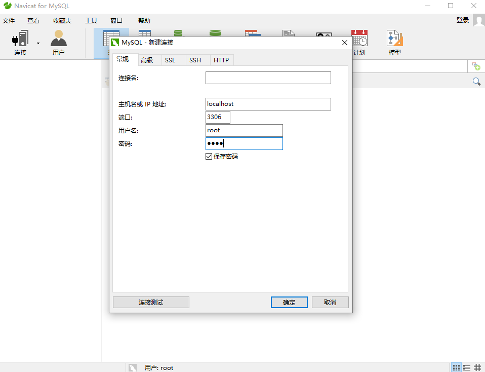
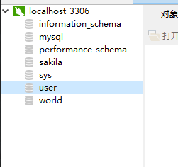
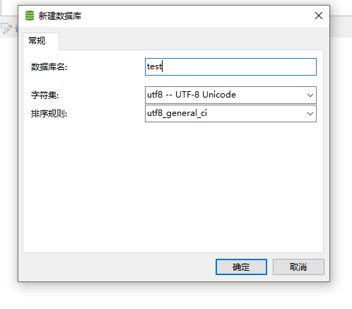
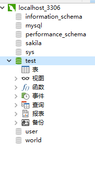
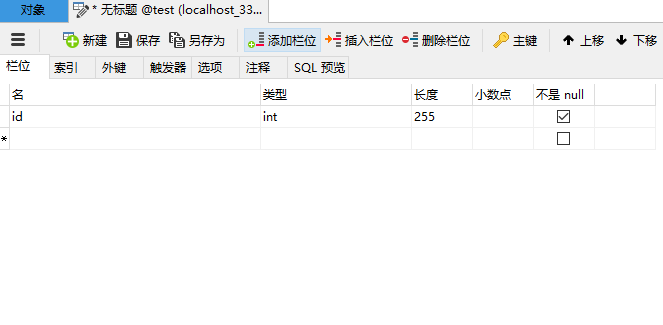
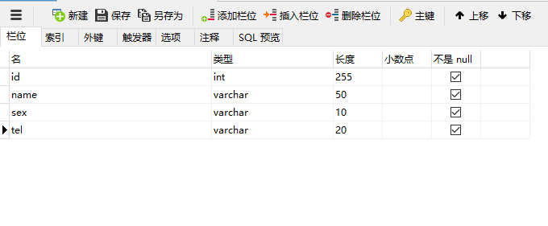
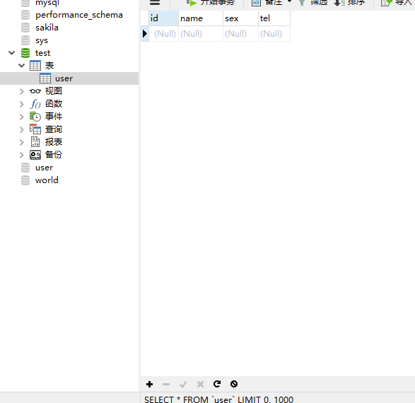
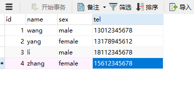
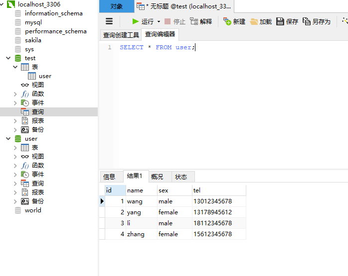

Navicat for MySQL的使用
====================================

Navicat for MySQL 简介
~~~~~~~~~~~~~~~~~~~~~~~~~~~~~~~~~

在前面SQL章节中我们已经学习了如何用sql命令来控制和管理mysql数据库，但是管理、操作还是比较有限。

而Navicat for MySQL是一款强大的的mysql数据库管理和开发工具，为MySQL量身订制，它拥有可视化的操作界面，并且提供了一套功能齐全的专用工具，相比于直接使用sql命令来操作数据库，使用Navicat for MySQL更便于初学者上手

它可以用于任何3.21或以上的MySQL数据库服务器，并支持大部份MySQL最新版本的功能，包括触发器、存储过程、函数、事件、检索、权限管理等等。

接下来我们通过一些实例来演示如何使用Navicat for MySQL

使用(增删改查)
~~~~~~~~~~~~~~~~~~~~~~~~~~~~~~

1. 连结数据库

如果前面已经连接过数据库了，可以直接双击左侧列表来连接。

如果没有连接，可以根据以下步骤进行连接：连接 -> MySQL -> 输入密码 -> 输入连接名(可选) -> 点击确定

    图13-3-1

左侧列表中出现灰色的图标，双击或者右键-> 打开连接，图标点亮就表示连接已打开

    图13-3-2

2. 新建数据库

右键点亮的连接图标 -> 点击新建数据库 -> 输入数据库名test -> 字符集选择utf-8, 以避免中文文本在控制台窗口中显示乱码

    图13-3-3

创建成功后，双击或者右键打开数据库。此时就能看到连接的层次了，localhost_3306连接下是各个数据库，数据库下则存有数据表，数据表是数据库最重要的组成部分。数据库像是一个框架，而数据表则是实质的内容

    图13-3-4

3. 新建数据表

新建数据表的操作与新建数据库类似。右键 test数据库下的 表 -> 新建表 -> 在表中输入id -> 如图设置选项 -> 右键空白部分或点击上面添加栏位按钮可在下方新建一行栏位，试着完成一张如图的表

    图13-3-5

    图13-3-6

保存为表名user的数据表。完成后就能在左侧看到新建的user表，双击打开user表，此时表内还没有记录

    图13-3-7

可在空行中输入要记录的数据，点击下方 + 号可以新增一行记录。重复该步骤制作以一张如图的表格。

    图13-3-8

4. 修改数据

同样的，修改数据也可双击选择需要修改的数据表 -> 选择需要修改的数据进行修改 -> 修改完成后就可以点击下方的'√'来应用更改即可

5. 查询数据

经过上面的步骤，我们知道可以直接点开对应的数据表来查看相关数据，接下来我们演示如何使用sql语句来查询

点击上方 查询 -> 点击 新建查询 -> 输入命令行查询user表 -> 点击运行 -> 下方就可以显示user表的信息

    图13-3-9

此时可以点击上方的 保存 将查询命令保存至数据库中，下一次查询相同内容时只需再次打开对应的查询文件然后运行即可。

6. 删除数据库(谨慎)

**注意：** 在Navicat for MySQL中删除数据库同样非常简单，但在删除数据库或数据表的过程中，务必要十分谨慎，因为在执行删除命令后，所有数据将会消失，且在没有备份的情况下将不能恢复。

创建一个新的table_test表，在需要删除的表或数据库上右键 -> 点击删除表或删除数据库 即可删除对应的表或数据库。
 

