搭建Node.js + Express + Mysql框架
=====================================================

前面我已经学习了html、node.js、express以及mysql的相关知识了，现在我们试着将他们串联起来

登录注册页面
~~~~~~~~~~~~~~~~

**html部分代码：**

1. 登录页面html文件代码:文件名为login.html

.. code-block:: html
    :linenos:

    <!DOCTYPE html>
    <html>
    <head>
        <meta charset="utf-8">
        <title>账户登录</title>
    </head>
    <body>
        <form action="http://127.0.0.1:3000/login" method="GET">
            帐号: <input type="text" name="name">  
            密码: <input type="text" name="password">  
            <input type="submit" value="登陆">
        </form>
    </body>
    </html>

2. 注册页面html文件代码：文件名为register.html

.. code-block:: html
    :linenos:

    <!DOCTYPE html>
    <html>
    <head>
        <meta charset="utf-8">
        <title>注册页面</title>
    </head>
    <body>
    <form action="http://127.0.0.1:3000/register" method="GET">
        帐号: <input type="text" name="name">  
        密码: <input type="text" name="password"> 
        电话: <input type="text" name="tel"> 
        <input type="submit" value="注册">
    </form>
    </body>                                                             
    </html>
    

**js部分代码：** (对应login.js文件)

1. 引入所需模块，创建express()实例
   
.. code-block:: js
    :linenos:

    var mysql = require('mysql');
    var express = require('express');
    
    //创建一个express()实例,通常命名为app
    var app = express();
 
2. 连接数据库部分

.. code-block:: js
    :linenos:

    //创建连接对象所需的五条基本信息：地址、端口、账号、密码、数据库
    var connection = mysql.createConnection({
        host:'127.0.0.1', //主机地址
        port:'3306',
        user:'root',
        password:'1234',
        database:'user'
    });
    
    //连接数据库
    connection.connect();

3. 启动服务器部分

.. code-block:: js
    :linenos:

    /*
        监听端口号3000，服务器启动后执行箭头函数
        服务器默认为IPV6模式，如需返回主机地址,应添加以个明确的主机名
    */
    var server = app.listen(3000, 'localhost', () => {   
        //获取主机地址
        var address = server.address().address; 
        
        //获取端口号
        var port = server.address().port; 

        //在控制台显示
        console.log("应用实例，访问地址为 http://%s:%s", address, port); 
    })

4. 设置登录路由

.. code-block:: js
    :linenos:

    //设置登录页面路由
    app.get('/login.html', function (req, res) {
        res.sendFile(__dirname + "/" + "login.html");
    })
    
    //定义登录路由
    app.get('/login',(req,res) => {
        var response = {
            'name': req.query.name,
            'password': req.query.password,
        };
    
        //sql语句，在user表中查询用户输入的账户和密码是否存在并在同一行记录
        var selectSQL = "select name,password from user where name = '" + response.name + "' and password = '" + response.password + "'";
    
        //使用query()方法,第一个参数为要执行的sql语句，第二个参数为一个回调函数，简单说就是执行sql语句的结果
        connection.query(selectSQL, (err,result) => {
            if (err) {
    
                //如果执行过程中发送错误，则将错误抛出
                console.log('[login error]-',err.message);
                res.josn({error:0, msg:err.message});
                return;            
            }
    
            //没有查询到结果
            if (result == '' ) {
                console.log('账号或密码错误');
                res.send('账号或密码错误');
                return;
            }
    
            //查询到结果
            console.log('ok');
            res.send('登录成功');
        })
    })

在终端启动login.js文件，在浏览器地址栏输入 http://127.0.0.1:3000/login.html 进入登录界面，试着输入user数据库中的user表对应的姓名和信息来查看结果

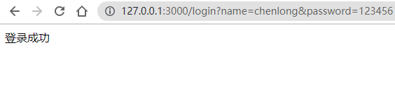

    图13-4-1

5. 设置注册路由

.. code-block:: js
    :linenos:

    //设置注册页面路由
    app.get('/register.html', function (req, res) {
        res.sendFile(__dirname + "/" + "register.html");
    })

    //sql语句，添加user表中的(name,password,tel)
    var addSql = 'INSERT INTO user(name,password,tel) VALUES(?,?,?)';

    //定义注册路由
    app.get('/register', function (req, res) {

        // 输出 JSON 格式
        var response = {
            "name": req.query.name,
            "password": req.query.password,
            "tel": req.query.tel
        };
        var addSqlParams = [response.name, response.password, response.tel];
            connection.query(addSql, addSqlParams, function (err, result) {
            if (err) {
                console.log('[INSERT ERROR] - ', err.message);
                
                //如果注册失败就给客户端返回0,并return，不会继续下面的代码
                return res.send("0"); 
            }
            if(response.name != '' && response.password != '' && response.tel != '' ){
                console.log("OK");
                return res.send('注册成功'); 
            }
            res.send('注册信息不能留空');
        });
    })

在终端启动login.js文件，在浏览器地址栏输入 http://127.0.0.1:3000/register.html 进入注册界面，试着输入信息来检测能否注册成功以及，注册成功后数据库中的变化

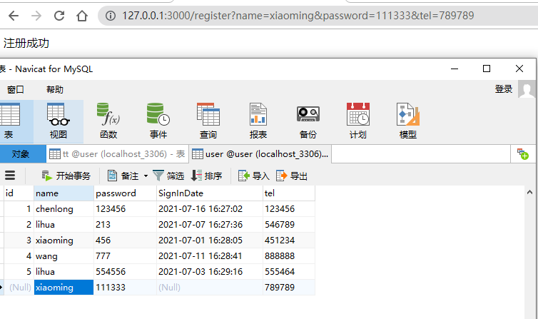

    图13-4-2    

利用postman发送请求进行测试
~~~~~~~~~~~~~~~~~~~~~~~~~~~~~~~~~~~~~~~~~~~~~~~~~~~~~~~~~~~~~~~~~~~~~~~~

上面测试中我们写了两个html页面来发送相关的数据，但是如果每次测试一个功能都要再写一个html页面或者一段html代码的话会很麻烦，这里我们推荐使用postman或者国产的apipost，这两款软件可以快速简单的提交http不同类型的请求，从而加快开发的速度

注意：apipost是具有相同功能的国产软件，且能免费使用基本功能，除了界面布局上的一些区别，其余功能基本一致

进入官网下载页面 https://www.postman.com/downloads/ ，点击download，选择对应版本下载，下载完成后双击即可自动安装

1. 安装完成后，双击打开postman，在地址栏中输入URl：http://127.0.0.1:3000/login

然后按照图示输入相应的参数，点击send发送后，会返回相应的结果

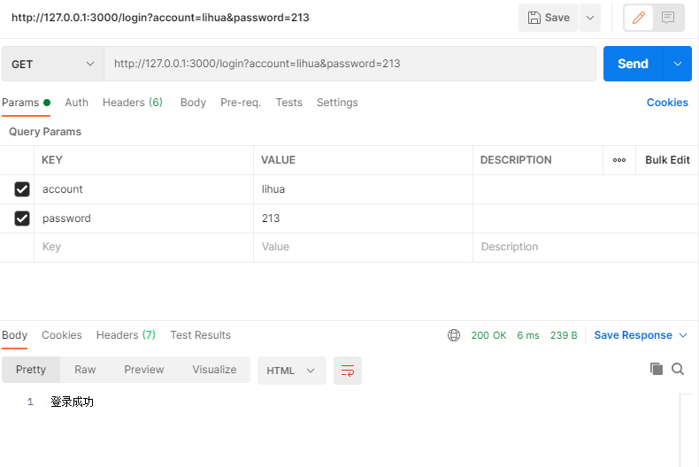

    图13-4-3

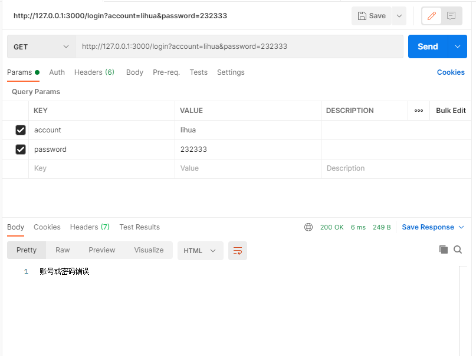

    图13-4-4

或者直接在地址栏中输入url：http://127.0.0.1:3000/login?name=lihua&password=213
也能返回相同结果

2. 注册模块也类似

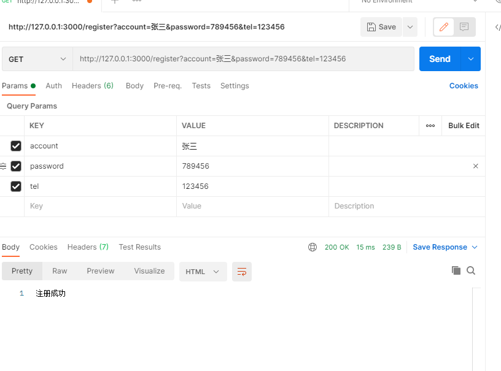

    图13-4-5

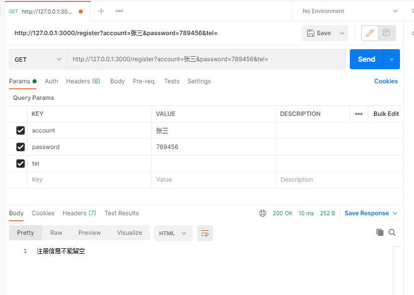

    图13-4-6

利用node.js创建接口，postman发送请求操作MySQL数据库
~~~~~~~~~~~~~~~~~~~~~~~~~~~~~~~~~~~~~~~~~~~~~~~~~~~~~~~~~~~~~~~~~~~~~

**问题：跨域**

1. 数据库连接和启动服务器部分

.. code-block:: js
    :linenos:

    var express = require('express')
    var mysql = require('mysql')
    var app = express()

    //连接数据库
    var connection = mysql.createConnection({
        //主机地址
        host:'localhost', 
        port:'3306',
        user:'root',
        password:'1234',
        database:'user',

        //连接超时的时间
        connectTimeout:5000,  

        // 是否允许一个query中包含多条sql语句
        multipleStatements: false 
    });
    connection.connect();

    //链接端口，启动服务器
    app.listen('8000',() => console.log('服务启动，http://localhost:8000'));

2. 创建跨域对象

.. code-block:: js
    :linenos:

    // 跨域
    var cors = require('cors')		

    //解决跨域
    app.use(cors()) 

    //json请求
    app.use(express.json()) 

    // 表单请求
    app.use(express.urlencoded({ extended: false })) 

1. 路由：查询，app.get路径('/user')

.. code-block:: js
    :linenos:

    //查询
    //以下功能只有在打开url: http://localhost:8000/user 发送GET请求才会执行
    app.get('/user', (req,res) => {

        //sql语句
        var sqlStr = 'SELECT * FROM user';

        //执行sql 语句，返回结果
        connection.query(sqlStr, (err, result) => {

            //错误抛出
            if (err) {
                console.log('[Search error]-',err.message);
                return res.send('获取失败');
            }
            if(result == '' ){
                return res.send('没有数据');
            }
            console.log('result:',result);
            res.json({msg:'成功',data:result});
        })
    });

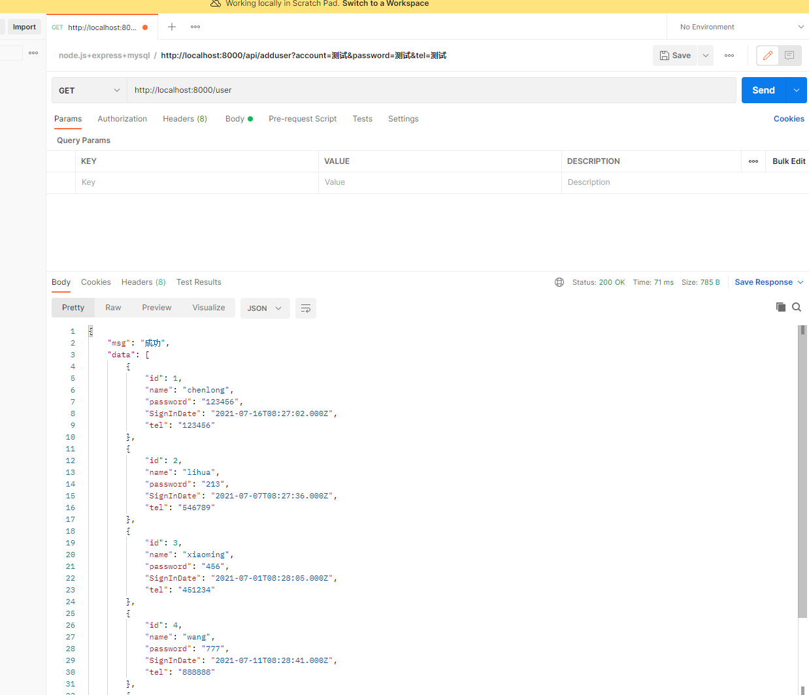

    发送get请求以及返回结果13-4-7

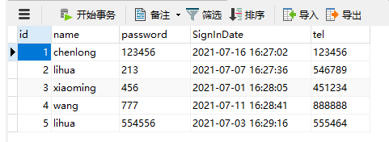

    数据库原图13-4-8

4. 路由：添加，app.post路径('/api/adduser')

.. code-block:: js
    :linenos:

    //添加
    app.post('/api/adduser', (req, res) => {
        var name = req.query.name;
        var password = req.query.password;
        var tel = req.query.tel;
        var sqlStr = 'insert into user(name, password, tel) values(?, ?, ?)';
        var sqlStrParanms = [name, password, tel];
        connection.query(sqlStr, sqlStrParanms, (err, result) => {
        if (err) {
            return res.json({ code: 0, message: 'error', affectedRows: 0 });
        }
        if (result.affectedRows === 0) {
            console.log(result);
            return res.json({ code: 0, message: "添加失败", affectedRows: 0 });
        }
        console.log('注册成功');
        res.json({code:200, message:'成功', Date:result});
        })
    })

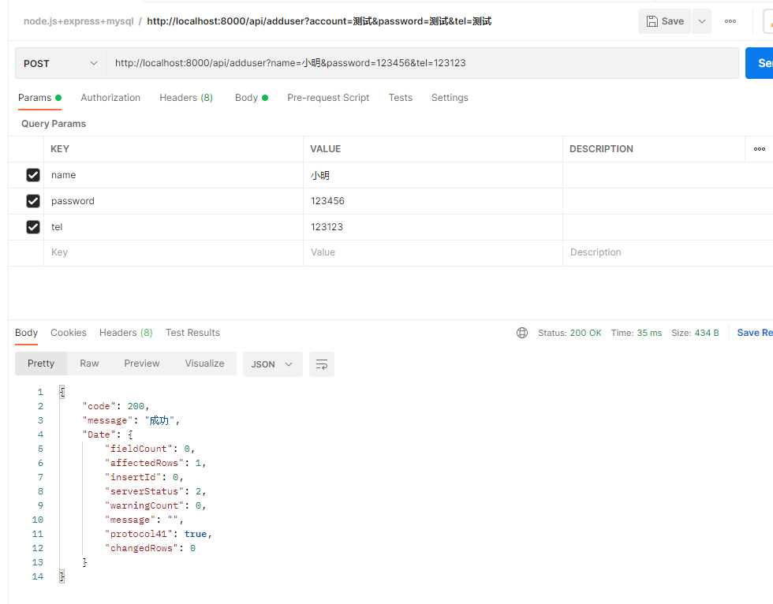

    发送post请求图13-4-9

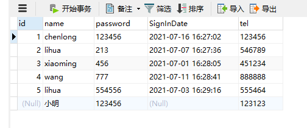

    数据库结果图13-4-10

5. 路由：添加通过body，app.post路径('/api/adduser/bybody')

.. code-block:: js
    :linenos:
    
    /*
        在body中携带添加的信息
        需要跨域请求，需要选择x-www-from-urlencoded
    */
    app.post('/api/adduser/bybody', (req, res) => {
        var user = req.body;
        console.log(user);
        var sqlStr = 'insert into user set ?';
        connection.query(sqlStr, user, (err, result) => {
            if (err) {
                return res.json({ code: 0, message: 'error', affectedRows: 0 });
            }
            if (result.affectedRows === 0) {
                return res.json({ code: 0, message: "添加失败", affectedRows: 0 });
            }
            res.json({code:200, message:'成功', Date:result}); 
       })
    })

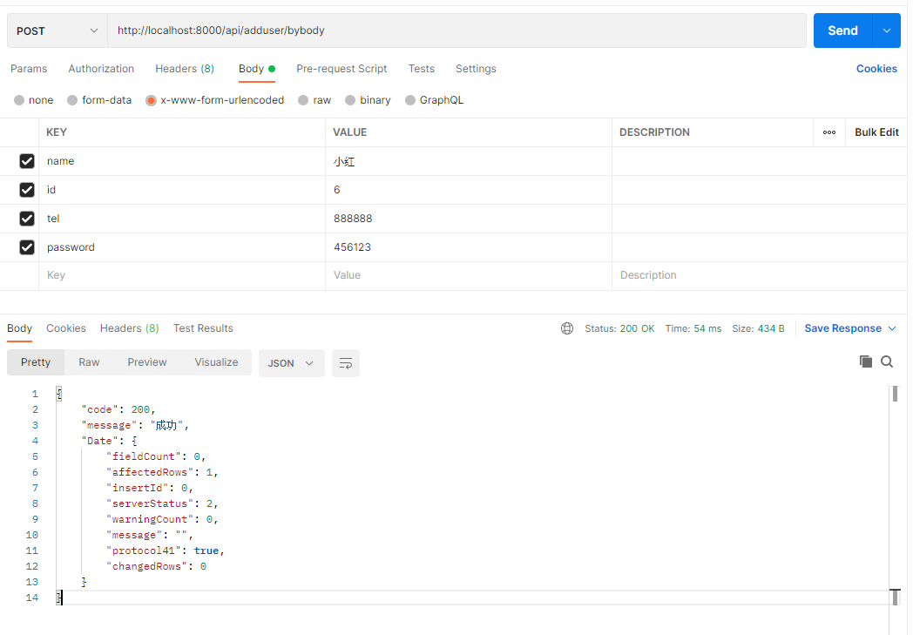

    发送psot的body请求图13-4-11

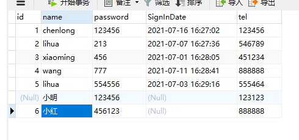

    数据库结果图13-4-12

1. 路由：修改app.post('/api/updateuser')

.. code-block:: js
    :linenos:

    //修改
    app.get('/api/updateuser', (req,res) => {
        //查询URL得id
        var id = req.query.id; 
        var sqlStr = 'update user set password = 123456 where id = ?';
        connection.query(sqlStr, id, (err,result) => {
            if (err) {
                return res.json({code:0, message: 'error', affectedRows: 0});
            }
            if(result.affectedRows == 0){
                console.log('修改失败');
                return res.json({code:0, message: '修改失败', affectedRows: 0});
            }
            console.log('修改成功');
            res.json({code:200, message:'修改成功', affectedRows:result.affectedRows});
        })
    })

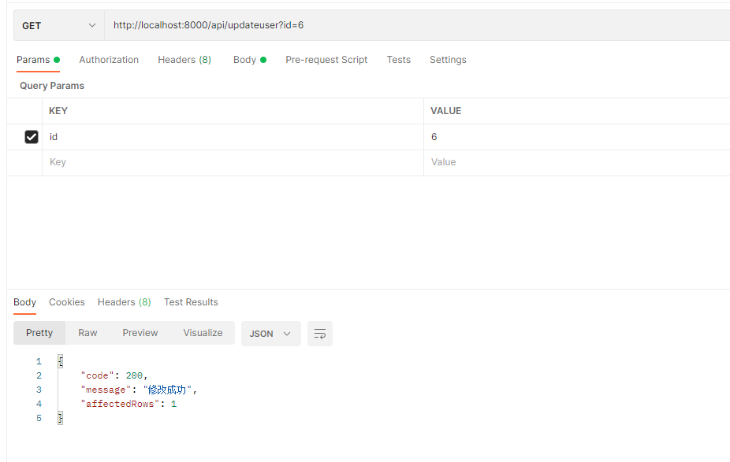

    发送get请求图13-4-13

    数据库图13-4-13

7. 路由：修改app.post('/api/updateuser/bybody')，

.. code-block:: js
    :linenos:
        
    //在body中携带参数的修改
    //x-www-from-urlencoded：就是application/x-www-from-urlencoded，会将表单内的数据转换为键值对，比如name=java&age=23
    app.post('/api/updateuser/bybody', (req, res) => {
        var sqlStr = 'update user set ? where id = ? '
        
        //req.body中返回的是一个对象
        var sqlStrParanms = [req.body, req.body.id]; 
        console.log(sqlStrParanms);
        connection.query(sqlStr, sqlStrParanms, (err, result) => {
            if(err){
                console.log(err.message);
                return res.json({code:0, msg: '更新失败', affectedRows: 0});
            }
            console.log(result);
            res.json({code:200, msg:'更新成功', affectedRows: result.affectedRows});
        })
    })

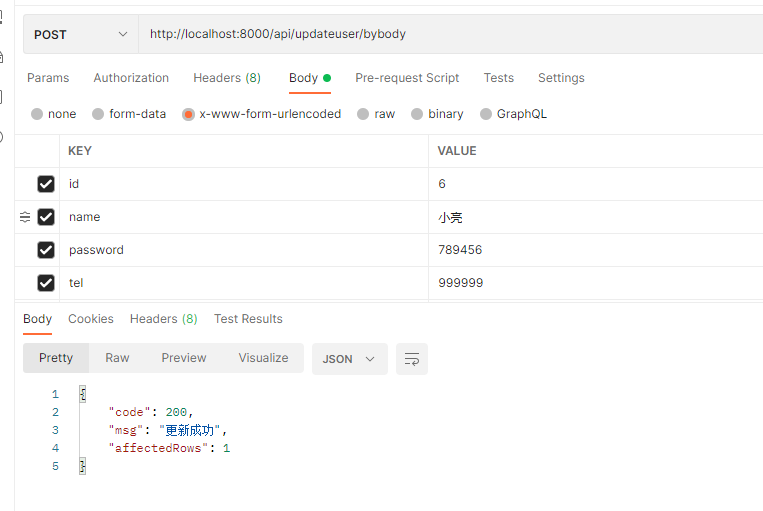

    发送post的body请求图13-4-15

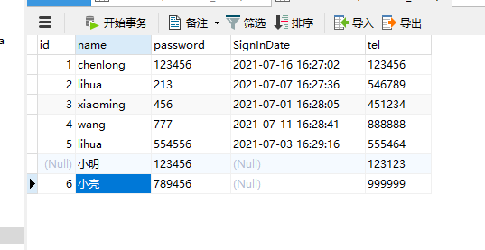

    数据库图13-4-16

跨域
~~~~~~~~~~~~~~~~~~~~~~~~~~

**同源的概念**：指协议，域名，端口都必须完全相同，才能称为同源

**违背同源的就是跨域**，它是由浏览器的同源策略造成的，是浏览器施加的安全限制。如：

http://www.123.com/index.html 调用  http://www.123.com/server.php （协议，域名，端口均相同,非跨域）

http://www.123.com/index.html 调用 http://www.456.com/server.php （主域名不同:123/456，跨域）

http://www.123.com/index.html 调用 https://www.123.com/server.php （协议不同:http/https，跨域）

