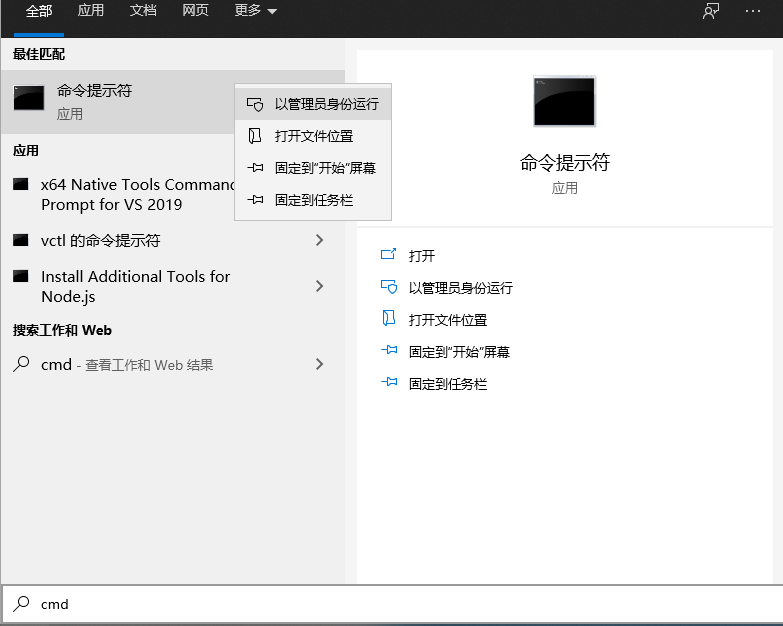

MYSQL的下载与使用
===================================

登入mysql
~~~~~~~~~~~~~~~~~
当 MySQL 服务已经运行时, 我们可以通过 MySQL 自带的客户端工具登录到 MySQL 数据库中, 首先打开命令提示符, 输入以下格式的命令:mysql -u root -p，回车确认
然后输入密码安装时设置的密码即可登录MySQL

    图10-2-1

或者我们也可以直接在搜索mysql，打开MySQL8.0 Command Line Client，然后直接输入密码即可登录mysql

    图10-2-2

.. figure:: ../media/10-2-3.png
    :align: center
    :alt: 

    图10-2-3

登录mysql后，输入 exit 或 quit 即可退出登录

.. figure:: ../media/10-2-4.png
    :align: center
    :alt: 

    图10-2-4

修改密码
~~~~~~~~~~~~~~~~~~~~~~~~~~~

由于修改密码需要管理员权限，所以我们以管理员身份打开命令提示符

    图10-2-5

一些简单的mysql命令
~~~~~~~~~~~~~~~~~~~~~~~~~~~~~~~~~

以下命令都基于登录MySQL数据库之后执行

1. SHOW DATABASES; 显示当前所有的数据库

其中test和user是我们新建的数据库，在后面的实验中你能更详细的了解要如何对MySQL数据库操作

    图10-2-6

2. USE test
   
执行以上命令后，你就已经成功选择了test数据库了，后续的操作命令都会在 test 数据库中执行

    图10-2-7

3. SHOW TABLES

改命令是基于上一个命令的，显示的是test数据库中的表数据，table1、table2、table3都是我们新建的数据表

    图10-2-8

    