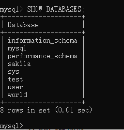

数据库的增删改查的SQL语句
===================================

在学习了sql语法之后，我们可以试着把前面的语法综合应用起来，在MySQL数据库中实现增删改查四个功能

开始本节实验前我们按照前面的方法，登录MySQL数据库

创建数据库
~~~~~~~~~~~~~~~~~

1. 输入 SHOW DATABASES; 列出 MySQL 数据库管理系统的数据库列表。

命令行：

.. code-block:: sql
    :linenos:

    SHOW DATABASES;

    图10-5-1

2. 输入 CREATE DATABASE; 创建一个名为test的数据库

命令行：

.. code-block:: sql
    :linenos:

    CREATE DATABASE;

    图10-5-2

3. 再次显示更改后的数据库，可以看见已经有test数据库

    图10-5-3

创建表
~~~~~~~~~~~~~~~~~~~~~~

1. 输入 USE test; 选择创建好的 test 数据库,输入 SHOW TABLES; 显示表，可以看到此时还没有数据表

.. code-block:: sql
    :linenos:

    USE test;
    
    SHOW TABLES;

    图10-5-4

以下的增删改查操作的都是基于这一步的选择数据库之后来进行的

1. 创建表CREATE TABLE test(id INT，name VARCHAR(255)，sex VARCHAR(255)，tel VARCHAR(255));

输入如下指令：

.. code-block:: sql
    :linenos:

    mysql> CREATE TABLE table_test(
        -> id INT NOT NULL AUTO_INCREMENT,
        -> name VARCHAR(50) NOT NULL,
        -> tel VARCHAR(50) NOT NULL,
        -> sex VARCHAR(20) NOT NULL,
        -> PRIMARY KEY (id)
        -> )ENGINE = InnoDB DEFAULT CHARSET = utf8;

代码解析: 在这段代码中，在基本的创建数据表代码上又多了几个参数

- NOT NULL 表示该列的值非空
- AUTO_INCREMENT 定义为列自增属性，一般用于主键，当插入数据时，数据的id会在上一个id的基础上加1
- PRIMARY KEY关键字用于定义列为主键。 您可以使用多列来定义主键，列间以逗号分隔。
- ENGINE 设置存储引擎，MySQL5.1版本后的默认储存引擎为InnoDB，5.1版本之前的默认存储引擎为MyIsam
- CHARSET 设置编码，为了能够显示中文，一般设置为utf8

    图10-5-5

3. 输入 SHOW TABLES; 可以看到有table_test表，输入SELECT * FROM table_test; 可以看到表内部的信息，此时表内还没有记录行

    图10-5-6

添加记录(行)
~~~~~~~~~~~~~~~~~~~~~~~~~~~~~~~~~~

1. 输入 INSERT INTO 命令行
   
.. code-block:: sql
    :linenos:

    mysql>INSERT INTO table_test 
        ->VALUES (1,'zhang','13012345678','male');

或者输入

.. code-block:: sql
    :linenos:

    mysql>INSERT INTO table_test 
        ->(name,tel,sex)
        ->VALUES ('wang','13187654321','female');

因为数据表主键的自增属性，即便不输入id的值，也能在插入记录时自动添加一个id，其值就是上一行id加1.

    图10-5-7

2. 输入SELECT * FROM table_test; 显示数据表内的数据，可以看到有两条记录行

    图10-5-8

3. 试着重复上述步骤，制作一张包含以下信息的表，并查看能否正常显示中文
   

    图10-5-9

修改数据
~~~~~~~~~~~~~~~~~~~~~~~~~~~~~~~

1. 输入UPDATE table_test 命令行
   
.. code-block:: sql
    :linenos:

    mysql>UPDATE table_test
        ->SET tel = 12312345678,name = '小天'
        ->WHERE id = 1;

2. 查看数据表，可以看到id=1对应行的数据已被修改
   

    图10-5-10

3. 重复上述步骤，在id列有自增属性的情况下，修改id会发生什么事呢

修改成已经存在的id号，会报错

    
    图10-5-11

如图因为id列的自增属性导致会报错，如果是修改其他列的数据，一列上即便有多个相同的数据也不会报错

    图10-5-12

修改成更大的id号，会自动排序

    图10-5-13

查询数据
~~~~~~~~~~~~~~~~~~~~~~~~~~~~~~~~

在上面的示例中我们已经尝试用SHOW和select来进行查询数据了，对应select，还可增加参数进行更小范围的查询

1. 输入命令行，选定列和对应行

.. code-block:: sql
    :linenos:

    mysql>SELECT id,name
        ->FROM table_test
        ->WHERE sex = 'female';

    图10-5-14

2. 通过limit限定返回的记录数，通过offset设置偏移量,默认偏移量为0

.. code-block:: sql
    :linenos:

    mysql>SELECT * FROM table_test
        ->WHERE sex = 'female' or sex = 'male'
        ->LIMIT 3 OFFSET 1;

    图10-5-15

删除数据库(谨慎)
~~~~~~~~~~~~~~~~~~~~~~~~~~~~~~~~

**注意: 数据库的删除操作无法返回，如果没有备份数据，数据将永远丢失，因此我们这里所演示的删除操作都是基于我们创建的数据库**

1. drop删除数据表

.. code-block:: sql
    :linenos:

    DROP TABLE table_test;

    图10-5-16

2. drop删除数据库的命令与删除数据表类似

.. code-block:: sql
    :linenos:

    DROP DATABASES test;

    图10-5-17

这样一来，test数据库以及其内的资料都将消失了

